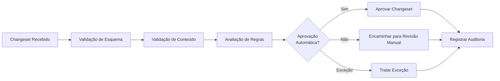

# Visão Geral dos Componentes

## Componentes Principais do Sistema

### 1. Módulo de Regras (Rules Engine)
Responsável por definir e aplicar as regras para aprovação condicional de changesets.

**Subcomponentes:**
- Approval Rules: Regras para determinar se um changeset pode ser aprovado automaticamente
- Schema Validation: Regras para validar a estrutura dos changesets
- Naming Conventions: Regras para convenções de nomenclatura

### 2. Módulo de Validação (Validators)
Implementa os mecanismos de validação dos changesets do Liquibase.

**Subcomponentes:**
- Schema Validators: Verificam a conformidade com o esquema do Liquibase
- Content Validators: Analisam o conteúdo dos changesets
- Security Validators: Verificam aspectos de segurança nos changesets

### 3. Módulo de Integração CI/CD (CI/CD Integration)
Pontos de integração com sistemas de integração contínua.

**Subcomponentes:**
- Jenkins Integration: Scripts e hooks para integração com Jenkins
- GitLab CI Integration: Configurações para pipelines do GitLab CI
- Generic Pipeline Support: Suporte para outros sistemas de CI/CD

### 4. Módulo de Exceções (Exception Handling)
Tratamento de situações especiais e casos que não se enquadram nas regras normais.

**Subcomponentes:**
- Exception Detection: Identificação de situações excepcionais
- Exception Handling: Processos para lidar com exceções
- Exception Reporting: Relatórios sobre exceções detectadas

### 5. Módulo de Auditoria (Audit & Logging)
Registro completo de todas as atividades do sistema.

**Subcomponentes:**
- Audit Logs: Registro de decisões de aprovação/rejeição
- Execution Logs: Registro detalhado da execução
- Error Logs: Registro de erros e falhas

## Fluxo de Trabalho Principal

## Tecnologias Utilizadas

- **Linguagem Principal**: Python 3.x
- **Framework**: Nenhum específico (scripts independentes)
- **Integração com Liquibase**: Parsing de XML/YAML do Liquibase
- **CI/CD**: Jenkins Pipelines, GitLab CI
- **Logging**: Módulo logging do Python
- **Configuração**: YAML ou JSON