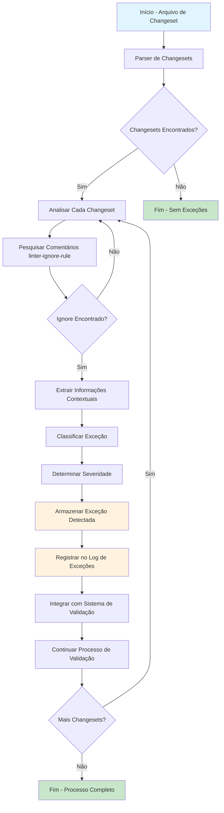

# Fluxo de Detecção e Análise de Exceções do Liquibase

## Visão Geral

Este documento detalha o fluxo completo de detecção e análise de exceções relacionadas ao uso de `linter-ignore-rule` em changesets do Liquibase. O processo envolve identificação, classificação, armazenamento e integração com os sistemas de validação existentes.

## Diagrama de Fluxo



## Etapas Detalhadas

### 1. Início - Arquivo de Changeset
- Recebe um ou mais arquivos de changeset do Liquibase para análise
- Pode ser chamado individualmente ou como parte de um processo em lote

### 2. Parser de Changesets
- Divide o arquivo em changesets individuais usando delimitadores padrão
  - `--changeset` para arquivos SQL formatados
  - Tags `<changeSet>` para arquivos XML
- Identifica o início e fim de cada changeset

### 3. Análise de Changesets
- Para cada changeset identificado:
  - Examina as linhas imediatamente após o cabeçalho do changeset
  - Procura por comentários que correspondam aos padrões de ignore

### 4. Detecção de linter-ignore-rule
Padrões reconhecidos:
```
--linter-ignore-rule:<nome-da-regra>
--  linter-ignore-rule:<nome-da-regra>
--linter-ignore-all
```

### 5. Extração de Informações Contextuais
Quando um ignore é encontrado, extrai:
1. Autor do changeset
2. ID do changeset
3. Nome da regra ignorada (ou "all" para linter-ignore-all)
4. Número da linha no arquivo
5. Nome/caminho do arquivo
6. Timestamp de detecção

### 6. Classificação de Exceções
Baseado na regra ignorada, classifica como:
- **Segurança**: no-drop-table, no-delete-all, etc.
- **Governança**: has-author, has-id, etc.
- **Qualidade**: naming-convention, etc.
- **Desempenho**: no-unbounded-update, etc.

### 7. Determinação de Severidade
Níveis de severidade:
- **Alta**: linter-ignore-all, regras críticas de segurança
- **Média**: Regras importantes de governança e segurança
- **Baixa**: Regras de qualidade e estilo

### 8. Armazenamento de Exceções
As exceções detectadas são armazenadas em:
- Repositório de exceções estruturado para consulta
- Logs especializados para auditoria
- Cache temporário para processamento rápido

### 9. Registro em Logs
Cada exceção detectada gera entradas em:
- `exception_decisions.log`: Decisões sobre exceções identificadas
- `audit_trail.log`: Rastreamento completo para auditoria

### 10. Integração com Sistema de Validação
- Notifica o motor de validação sobre exceções a serem consideradas
- Marca as regras específicas como ignoradas para o changeset relevante
- Permite que a validação continue normalmente para outras regras

### 11. Continuidade do Processo
- Retorna controle para o motor de validação principal
- Permite processamento de outros changesets no mesmo arquivo
- Finaliza quando todos os changesets forem analisados

## Cenários Especiais

### Múltiplos Ignores no Mesmo Changeset
```sql
--changeset autor:id
--linter-ignore-rule:no-drop-table
--linter-ignore-rule:has-author
DROP TABLE temporaria;
```
- Todos os ignores válidos são registrados separadamente
- Cada um recebe classificação própria de severidade

### Ignore Mal Formado
```sql
--changeset autor:id
--linter-ignore-rul:no-drop-table  <!-- erro de digitação -->
DROP TABLE temporaria;
```
- Pode ser sinalizado como alerta de possível erro de digitação
- Não é considerado um ignore válido

### Ignore Fora de Contexto
```sql
--changeset autor:id
CREATE TABLE teste (id INT);
--linter-ignore-rule:no-drop-table  <!-- localização incorreta -->
DROP TABLE temporaria;
```
- Pode ser sinalizado como má prática
- Consideração especial durante revisões manuais