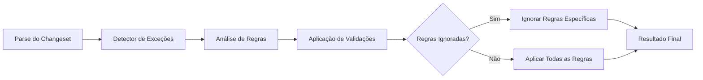

# Integração com Módulo de Validação Existente

## 1. Arquitetura de Integração

### 1.1 Ponto de Extensão
O detector de `linter-ignore-rule` será integrado como um componente no pipeline de validação existente, posicionado antes da execução das regras principais mas após o parse inicial dos changesets.

### 1.2 Interface de Comunicação
O detector irá comunicar-se com o motor de validação através de uma interface padronizada:

```python
class ExceptionDetectionInterface:
    def detect_exceptions(self, changeset_file: str) -> List[ExceptionRecord]:
        """
        Detecta exceções linter-ignore-rule em um arquivo de changeset
        
        Args:
            changeset_file: Caminho para o arquivo de changeset
            
        Returns:
            Lista de registros de exceções detectadas
        """
        pass
    
    def get_ignored_rules_for_changeset(self, author: str, id: str) -> List[str]:
        """
        Obtém lista de regras ignoradas para um changeset específico
        
        Args:
            author: Autor do changeset
            id: ID do changeset
            
        Returns:
            Lista de nomes de regras ignoradas
        """
        pass
```

## 2. Fluxo de Integração

### 2.1 Posição no Pipeline de Validação


### 2.2 Sequência de Operações
1. **Parse do Changeset**: O parser existente processa o arquivo
2. **Detecção de Exceções**: Nosso componente identifica linter-ignore-rules
3. **Registro de Exceções**: Exceções são armazenadas e classificadas
4. **Comunicação com Validador**: Informações são passadas para o motor de validação
5. **Execução de Validações**: Validações normais ocorrem com exceções consideradas
6. **Relatório Final**: Resultado inclui informações sobre exceções tratadas

## 3. Modificações Necessárias no Validation Engine

### 3.1 Nova Interface de Exceções
Adicionar método à classe `ValidationEngine`:

```python
class ValidationEngine:
    def __init__(self):
        self.exception_detector = ExceptionDetector()
        # ... outras inicializações
    
    def validate_changeset_file(self, file_path: str) -> ValidationResult:
        # Detectar exceções primeiro
        exceptions = self.exception_detector.detect_exceptions(file_path)
        
        # Registrar exceções para auditoria
        self._log_exceptions(exceptions)
        
        # Prosseguir com validação normal
        parsed_changesets = self.parser.parse(file_path)
        
        results = []
        for changeset in parsed_changesets:
            # Obter regras ignoradas para este changeset
            ignored_rules = self.exception_detector.get_ignored_rules_for_changeset(
                changeset.author, changeset.id
            )
            
            # Validar com consideração às exceções
            result = self._validate_with_exceptions(changeset, ignored_rules)
            results.append(result)
        
        return ValidationResult(results)
    
    def _validate_with_exceptions(self, changeset, ignored_rules: List[str]) -> ChangesetValidationResult:
        # Aplicar todas as regras exceto as ignoradas
        applicable_rules = [rule for rule in self.rules if rule.name not in ignored_rules]
        
        violations = []
        for rule in applicable_rules:
            if not rule.validate(changeset):
                violations.append(Violation(rule.name, rule.error_message))
        
        return ChangesetValidationResult(changeset.author, changeset.id, violations)
```

### 3.2 Estrutura de Dados Compartilhada

#### 3.2.1 Modelo de Exceção Compartilhado
```python
@dataclass
class ExceptionRecord:
    exception_id: str
    changeset_author: str
    changeset_id: str
    file_name: str
    line_number: int
    rule_name: str
    exception_type: str  # "specific", "all", "malformed"
    severity: str  # "low", "medium", "high", "critical"
    detected_at: datetime
    environment: str
    justification: str
    status: str  # "pending", "approved", "rejected"
```

#### 3.2.2 Serviço de Exceções
```python
class ExceptionService:
    def __init__(self, repository: ExceptionRepository):
        self.repository = repository
    
    def register_exception(self, exception_record: ExceptionRecord):
        """Registra uma nova exceção detectada"""
        self.repository.save(exception_record)
    
    def get_active_ignored_rules(self, author: str, id: str) -> List[str]:
        """Obtém regras atualmente ignoradas para um changeset"""
        exceptions = self.repository.find_active_by_changeset(author, id)
        return [ex.rule_name for ex in exceptions if ex.status == "approved"]
    
    def requires_manual_approval(self, exception_record: ExceptionRecord) -> bool:
        """Determina se uma exceção requer aprovação manual"""
        return exception_record.severity in ["high", "critical"]
```

## 4. Componentes Adicionais Necessários

### 4.1 Repositório de Exceções
```python
class ExceptionRepository:
    def save(self, exception_record: ExceptionRecord):
        """Salva um registro de exceção"""
        pass
    
    def find_by_changeset(self, author: str, id: str) -> List[ExceptionRecord]:
        """Encontra todas as exceções para um changeset"""
        pass
    
    def find_active_by_changeset(self, author: str, id: str) -> List[ExceptionRecord]:
        """Encontra exceções ativas (não expiradas/rejeitadas) para um changeset"""
        pass
    
    def find_pending_approvals(self) -> List[ExceptionRecord]:
        """Encontra exceções aguardando aprovação"""
        pass
```

### 4.2 Detector de Exceções
```python
class LiquibaseIgnoreDetector:
    def __init__(self, exception_service: ExceptionService):
        self.exception_service = exception_service
        self.patterns = [
            r"--linter-ignore-rule:([a-zA-Z0-9\-_]+)",
            r"--linter-ignore-all"
        ]
    
    def detect_in_file(self, file_path: str) -> List[ExceptionRecord]:
        """Detecta exceções linter-ignore-rule em um arquivo"""
        exceptions = []
        
        with open(file_path, 'r') as file:
            lines = file.readlines()
        
        changeset_boundaries = self._find_changeset_boundaries(lines)
        
        for start, end in changeset_boundaries:
            changeset_info = self._parse_changeset_header(lines[start])
            ignore_comments = self._find_ignore_comments(lines[start:end])
            
            for comment, line_num in ignore_comments:
                exception = self._create_exception_record(
                    changeset_info, comment, line_num, file_path
                )
                exceptions.append(exception)
        
        return exceptions
    
    def _find_changeset_boundaries(self, lines: List[str]) -> List[Tuple[int, int]]:
        """Encontra limites de changesets no arquivo"""
        boundaries = []
        start = None
        
        for i, line in enumerate(lines):
            if "--changeset" in line:
                if start is not None:
                    boundaries.append((start, i))
                start = i
        
        if start is not None:
            boundaries.append((start, len(lines)))
        
        return boundaries
    
    def _parse_changeset_header(self, header_line: str) -> Dict[str, str]:
        """Extrai autor e ID do cabeçalho do changeset"""
        # Implementar parsing de "--changeset autor:id"
        pass
    
    def _find_ignore_comments(self, lines: List[str]) -> List[Tuple[str, int]]:
        """Encontra comentários de ignore nas linhas"""
        ignores = []
        
        for i, line in enumerate(lines):
            for pattern in self.patterns:
                match = re.search(pattern, line)
                if match:
                    ignores.append((line.strip(), i + 1))  # +1 porque line_num é 1-based
        
        return ignores
```

## 5. Considerações de Desempenho

### 5.1 Cache de Exceções
Implementar cache para evitar reprocessamento de arquivos idênticos:
```python
class ExceptionCache:
    def __init__(self):
        self.cache = {}
        self.file_hashes = {}
    
    def get_or_detect(self, file_path: str) -> List[ExceptionRecord]:
        """Obtém exceções do cache ou detecta se necessário"""
        file_hash = self._calculate_hash(file_path)
        
        if file_path in self.file_hashes and self.file_hashes[file_path] == file_hash:
            return self.cache.get(file_path, [])
        
        # Arquivo mudou ou não está em cache, detectar novamente
        detector = LiquibaseIgnoreDetector()
        exceptions = detector.detect_in_file(file_path)
        
        self.cache[file_path] = exceptions
        self.file_hashes[file_path] = file_hash
        
        return exceptions
```

### 5.2 Processamento Paralelo
Para arquivos grandes ou em lote, utilizar processamento paralelo:
```python
def detect_exceptions_parallel(file_paths: List[str]) -> Dict[str, List[ExceptionRecord]]:
    """Detecta exceções em múltiplos arquivos paralelamente"""
    with ThreadPoolExecutor(max_workers=4) as executor:
        future_to_file = {
            executor.submit(detect_exceptions_single, file_path): file_path
            for file_path in file_paths
        }
        
        results = {}
        for future in as_completed(future_to_file):
            file_path = future_to_file[future]
            try:
                results[file_path] = future.result()
            except Exception as exc:
                results[file_path] = []
                print(f"Erro ao processar {file_path}: {exc}")
        
        return results
```

## 6. Tratamento de Erros e Exceções

### 6.1 Erros de Parsing
- Arquivos mal formatados
- Changesets sem cabeçalhos válidos
- Comentários de ignore em locais inválidos

### 6.2 Erros de Integração
- Falhas na comunicação entre componentes
- Repositório indisponível
- Dados inconsistentes

### 6.3 Estratégia de Resiliência
- Logging detalhado de erros
- Continuidade do processo mesmo com falhas parciais
- Mecanismos de retry para operações críticas
- Fallback para validação padrão quando detecção falha