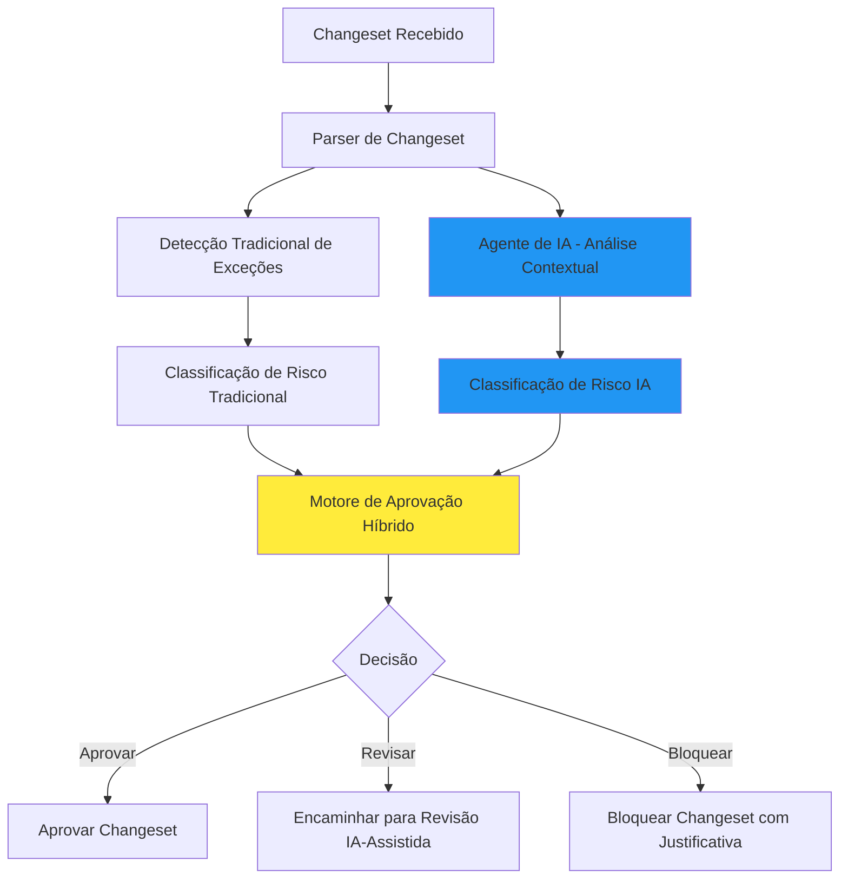

# Etapas para Implementação de Agentes de IA na Governança do Liquibase

Com base na análise dos documentos técnicos do projeto, segue o detalhamento das etapas para implementação dos agentes de IA:

## 1. Arquitetura Geral do Sistema com IA

A implementação seguirá a estrutura modular já existente, integrando agentes de IA nos seguintes componentes:

```
/src/
  /core/                  # Lógica central com integração de IA
  /intelligence/          # Novo módulo para componentes de IA
  /models/                # Modelos de dados estendidos para IA
  
/rules/                   
  /ai_enhanced_rules/     # Regras tradicionais com complemento de IA

/validators/
  /ai_validators/         # Validadores com capacidades de IA
  
/exceptions/
  /ai_detection/          # Detecção avançada de exceções com IA
  /ai_classification/     # Classificação inteligente de riscos
```

## 2. Capacidades Específicas dos Agentes de IA

### 2.1. Análise de Tabelas Temporárias/Staging
- Detecção automática de tabelas temporárias e staging
- Avaliação de contexto de uso (ETL, testes, processamento batch)
- Classificação de risco baseada em tamanho e complexidade

### 2.2. Detecção de Dados Críticos
- Identificação de PII (CPF/CNPJ, RG, etc.)
- Detecção de dados financeiros e de saúde
- Análise de credenciais e informações de segurança
- Classificação automática por níveis de criticidade

### 2.3. Predição de Impacto em Cascata
- Análise de dependências diretas e indiretas
- Predição de degradação de performance
- Avaliação de riscos de downtime
- Verificação de integridade referencial

### 2.4. Análise de Padrões de Desenvolvedores
- Análise histórica de atividades
- Detecção de anomalias comportamentais
- Classificação de perfis de risco
- Recomendações personalizadas

## 3. Fases de Implementação

### Fase 1: Integração Básica de IA (3 meses)
- Implementação do módulo `/intelligence/` com componentes fundamentais
- Integração com motor de aprovação existente
- Desenvolvimento de agentes para análise de linguagem natural
- Criação de API para comunicação entre componentes

### Fase 2: Capacidades Contextuais Avançadas (4 meses)
- Desenvolvimento de modelos preditivos para impacto em cascata
- Implementação de detecção inteligente de dados críticos
- Análise de contexto para tabelas temporárias/staging
- Integração com histórico de decisões para aprendizado

### Fase 3: Automação e Otimização (3 meses)
- Implementação de auto-aprovação para mudanças de baixo risco
- Desenvolvimento de sistema de recomendações automáticas
- Criação de mecanismos de explicabilidade para decisões de IA
- Integração com ferramentas de monitoramento pós-deploy

## 4. Requisitos Técnicos

### 4.1. Infraestrutura Necessária
- Cluster Kubernetes para containers de modelos
- Banco de dados vetorial para embeddings
- Sistema de streaming para análise em tempo real
- Armazenamento para datasets de treinamento

### 4.2. Stack Tecnológico
- Python 3.9+ para backend
- TensorFlow/PyTorch para modelos de ML
- FastAPI para APIs de serviço
- Redis para cache distribuído
- PostgreSQL para armazenamento de perfis

### 4.3. Integrações Externas
- API do Git para histórico de commits
- Métricas de monitoramento (Prometheus/Grafana)
- Sistema de tickets para workflow de aprovação
- Microsoft Teams para notificações

## 5. Fluxo de Trabalho Aprimorado com IA



## 6. Métricas de Sucesso

### 6.1. Métricas Técnicas
- Redução de 60% no tempo de análise de changesets
- Acurácia de 90%+ na classificação de risco
- Redução de 80% em mudanças problemáticas em produção
- Taxa de falsos positivos < 5%

### 6.2. Métricas de Negócio
- Redução de 50% no tempo de revisão manual
- Aumento de 40% na produtividade dos ADs
- Redução de 70% em incidentes relacionados a mudanças
- Melhoria de 30% na qualidade geral dos changesets

## 7. Considerações de Segurança e Compliance

- Todos os modelos de IA serão auditáveis e explicáveis
- Implementação de controles rigorosos para auto-aprovações
- Conformidade com LGPD e GDPR para análise de dados de desenvolvedores
- Criptografia ponta a ponta para dados sensíveis
- Versionamento completo de modelos com rollback seguro

A implementação progressiva dos agentes de IA permitirá uma automação inteligente do processo de governança, mantendo o controle humano onde necessário e aumentando significativamente a eficiência e segurança das mudanças no banco de dados.