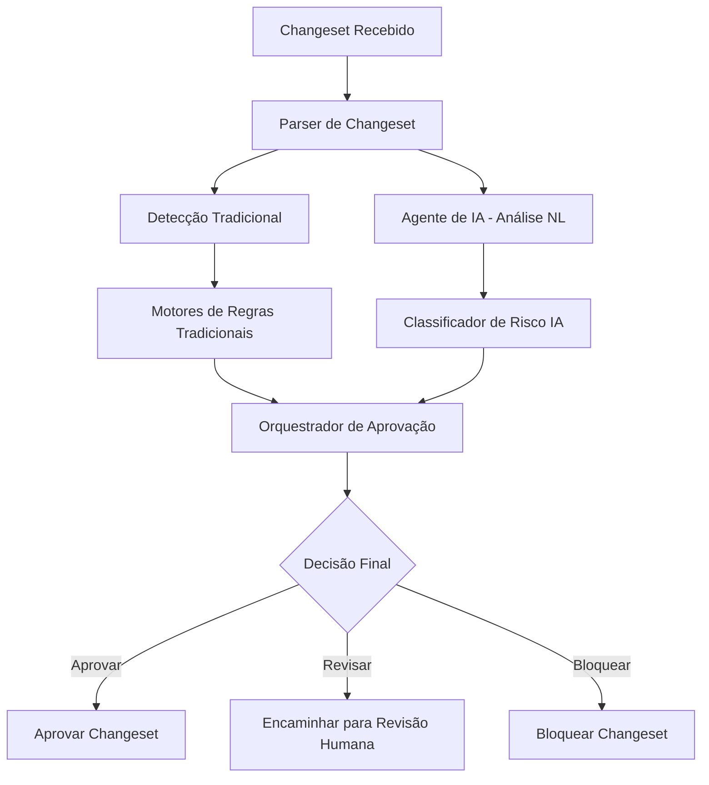

# Análise de Viabilidade Técnica para Implementação de Agentes de IA

## Visão Geral da Arquitetura Atual

Com base na análise dos documentos do projeto, o sistema atual possui uma arquitetura modular bem estruturada:

```
/src/
  /core/                # Lógica central do sistema
  /utils/               # Funções utilitárias
  /models/              # Modelos de dados
  /cli/                 # Interface de linha de comando

/rules/                 # Definições de regras para aprovação condicional
  /approval_rules/
  /schema_validation/
  /naming_conventions/

/validators/            # Componentes de validação de changesets
  /schema_validators/
  /content_validators/
  /security_validators/

/exceptions/            # Tratamento de exceções e casos especiais
  /detection/
  /classification/
  /storage/
  /integration/
  /handling/
  /reporting/

/ci-scripts/            # Integração com sistemas de CI/CD
  /jenkins/
  /gitlab_ci/
  /generic_pipelines/

/logs/                  # Sistema de auditoria e logging
  /audit_logs/
  /execution_logs/
  /error_logs/

/docs/                  # Documentação técnica
/tests/                 # Suíte de testes automatizados
```

## Componentes Relevantes para Integração de IA

### 1. Módulo de Detecção de Exceções (`/exceptions/detection/`)
- `liquibase_ignore_detector.py` já implementa detecção de linter-ignore-rule
- Ponto de entrada ideal para integração de análise de linguagem natural
- Possui estrutura extensível para adicionar novos detectores

### 2. Módulo de Classificação de Exceções (`/exceptions/classification/`)
- `exception_classifier.py` classifica exceções com base em critérios de severidade
- Ponto ideal para integrar modelos de machine learning para classificação multinível
- Atualmente usa regras estáticas que podem ser complementadas com IA

### 3. Módulo de Tratamento de Exceções (`/exceptions/handling/`)
- `manual_review_processor.py` encaminha exceções para revisão humana
- Ponto ideal para integrar agentes de IA como "revisores virtuais"
- `exception_resolver.py` resolve exceções automaticamente quando possível

### 4. Motor de Aprovação (`/src/core/approval_engine.py`)
- Coordena regras e validações para aprovação automática
- Ponto ideal para integrar decisões de agentes de IA
- Pode ser estendido para considerar recomendações de IA

## Viabilidade Técnica por Fases

### Fase 1: Validação Básica (Substituição do Linter)

#### Viabilidade: ALTA

**Componentes existentes que podem ser reutilizados:**
- Motor de aprovação (`approval_engine.py`)
- Validadores (`/validators/`)
- Estrutura de logging (`/logs/`)
- Modelo de dados (`/src/models/`)

**Novos componentes necessários:**
- Agente de análise de linguagem natural para comentários
- Sistema de geração de relatórios mais descritivos
- Interface de extensão para regras de IA

**Integração com componentes existentes:**
```python
# Exemplo de integração com o motor de aprovação existente
class EnhancedApprovalEngine(ApprovalEngine):
    def __init__(self):
        super().__init__()
        self.ai_analyzer = NaturalLanguageAnalyzer()
        self.risk_classifier = RiskClassifier()
    
    def evaluate_changeset(self, changeset):
        # Avaliação tradicional
        traditional_result = super().evaluate_changeset(changeset)
        
        # Análise de IA adicional
        ai_analysis = self.ai_analyzer.analyze(changeset.comments)
        risk_score = self.risk_classifier.classify(changeset)
        
        # Combinação de resultados
        return self.combine_results(traditional_result, ai_analysis, risk_score)
```

### Fase 2: Inteligência Contextual

#### Viabilidade: MÉDIA-ALTA

**Requisitos:**
- Acesso ao histórico de changesets aprovados/rejeitados
- Modelo de machine learning para classificação de risco
- Sistema de sugestões automáticas de correção

**Componentes necessários:**
- Repositório de histórico de decisões (`decision_history_repository.py`)
- Modelo de classificação de risco (`risk_classification_model.py`)
- Sistema de sugestões (`suggestion_engine.py`)

**Integração:**
- Ampliar o `exception_classifier.py` para considerar contexto histórico
- Estender o `approval_engine.py` para incluir análises preditivas
- Criar novo módulo `/intelligence/` para componentes de IA

### Fase 3: Automação Completa

#### Viabilidade: MÉDIA

**Requisitos avançados:**
- Auto-aprovação de mudanças de baixo risco
- Geração automática de testes
- Integração com ferramentas de monitoramento pós-deploy

**Desafios técnicos:**
- Garantir segurança em auto-aprovações
- Qualidade da geração automática de testes
- Complexidade da integração com ferramentas de monitoramento

## Considerações Técnicas

### Infraestrutura Necessária
1. **Recursos computacionais para treinamento de modelos**
2. **Armazenamento para datasets de treinamento**
3. **Infraestrutura para inferência em tempo real**
4. **Sistema de versionamento de modelos**

### Integração com Arquitetura Existente


### Pontos de Extensibilidade na Arquitetura Atual
1. **Interface de regras bem definida** - Facilita substituição parcial por IA
2. **Sistema de logging robusto** - Fornece dados para treinamento
3. **Estrutura modular** - Permite introdução incremental de IA
4. **API de integração com CI/CD** - Facilita integração com agentes externos

## Recomendações de Implementação

### Abordagem Incremental
1. **Começar com análise de linguagem natural** nos comentários
2. **Integrar classificação de risco** baseada em regras existentes
3. **Expandir para modelos preditivos** com histórico de decisões
4. **Implementar auto-aprovação** apenas após validação extensiva

### Requisitos Não-Funcionais
1. **Performance** - Inferência em tempo real (< 1 segundo)
2. **Segurança** - Controles rigorosos para auto-aprovações
3. **Auditabilidade** - Registro completo de decisões de IA
4. **Explicabilidade** - Capacidade de explicar decisões de IA

## Conclusão

A implementação de agentes de IA para automação do processo de revisão de changesets é **tecnicamente viável** com a arquitetura existente. O sistema foi projetado com modularidade e pontos de extensão que facilitam a introdução gradual de funcionalidades de IA.

Os principais pontos fortes que suportam essa implementação:
- Arquitetura modular e bem definida
- Interfaces claras entre componentes
- Sistema de logging robusto para treinamento
- Estrutura de testes automatizados

Os principais desafios:
- Necessidade de dados históricos de qualidade para treinamento
- Garantia de segurança em decisões automatizadas
- Balanceamento entre automação e controle humano