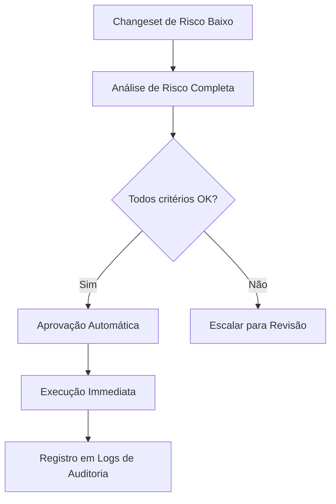
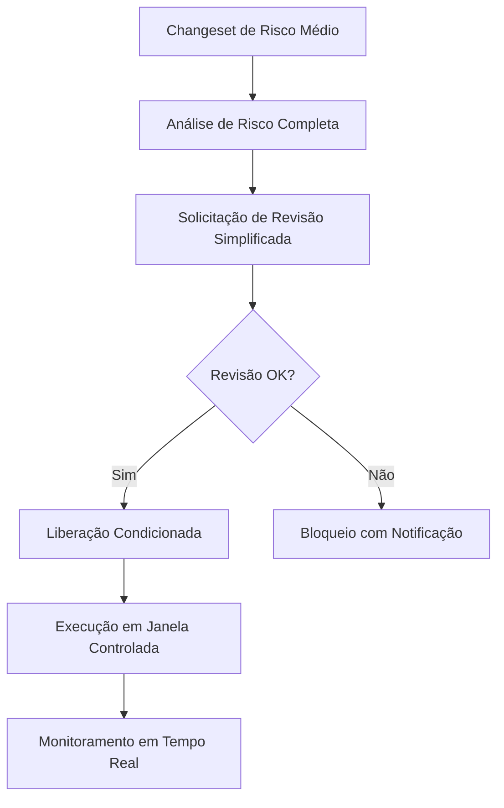
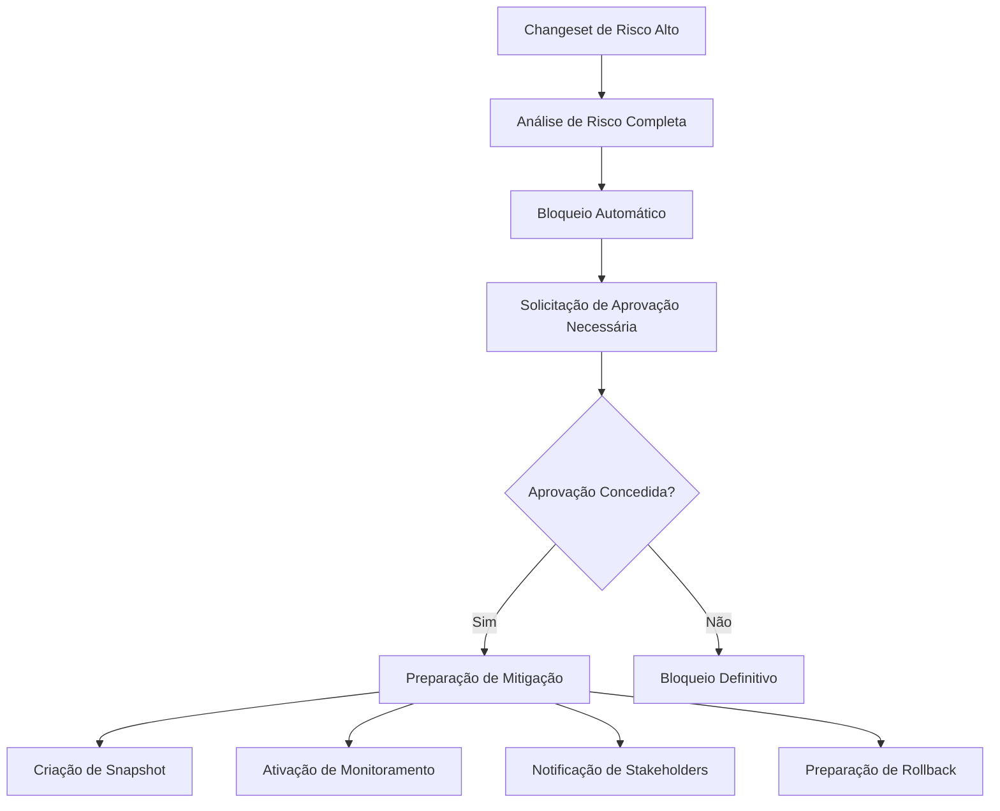
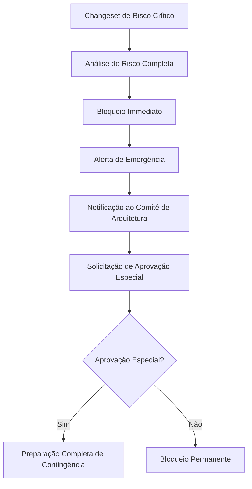
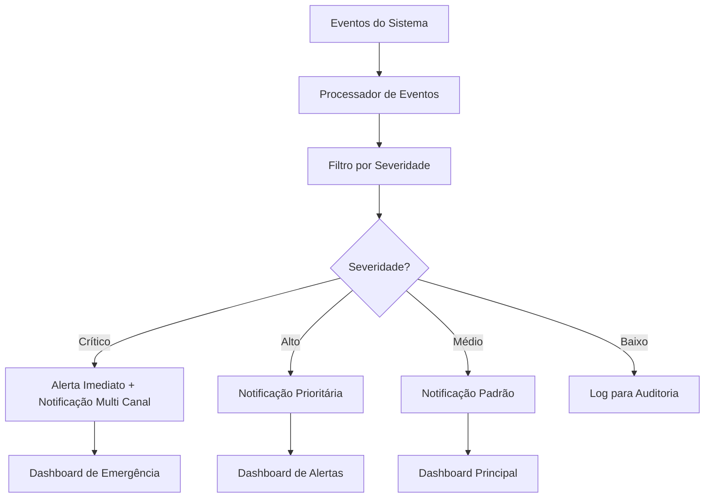

# Estratégias de Mitigação Automática de Riscos para Sistema de Governança Automatizada do Liquibase

## 1. Visão Geral

Este documento define as estratégias de mitigação automática de riscos para o sistema de governança automatizada do Liquibase. As estratégias são projetadas para responder automaticamente aos diferentes níveis de risco identificados, proporcionando uma abordagem proativa e adaptativa para minimizar impactos negativos de mudanças problemáticas no banco de dados.

## 2. Tipos de Mitigação Automática Baseados em Níveis de Risco

### 2.1. Níveis de Risco e Mitigações Correspondentes

#### 2.1.1. Risco Baixo
Para mudanças classificadas como risco baixo:

**Características típicas:**
- Dados afetados < 100 registros
- Sem dados críticos/sensíveis
- Baixo impacto em cascata (< 2 dependências diretas)
- Desenvolvedor com perfil de baixo risco
- Ambiente de desenvolvimento/teste

**Mitigações automáticas:**
- Aprovação automática sem revisão humana
- Registro para auditoria em log de decisões
- Execução imediata no pipeline CI/CD
- Notificação opcional para time responsável



#### 2.1.2. Risco Médio
Para mudanças classificadas como risco médio:

**Características típicas:**
- Dados afetados entre 100-1000 registros
- Potencial impacto em dados sensíveis
- Médio impacto em cascata (3-5 dependências diretas)
- Desenvolvedor com perfil neutro ou médio
- Ambiente de staging/homologação

**Mitigações automáticas:**
- Aprovação com revisão simplificada
- Execução em janela de tempo limitada
- Bloqueio automático fora de horário comercial
- Notificação ao time de desenvolvimento
- Geração de relatório sumário para revisão posterior



#### 2.1.3. Risco Alto
Para mudanças classificadas como risco alto:

**Características típicas:**
- Dados afetados entre 1000-10000 registros
- Impacto em dados críticos identificados
- Alto impacto em cascata (6-10 dependências diretas)
- Desenvolvedor com perfil de risco moderado
- Ambiente de pré-produção

**Mitigações automáticas:**
- Revisão obrigatória por aprovador designado
- Execução apenas em janela de manutenção programada
- Criação automática de snapshot do estado anterior
- Ativação de monitoramento intensivo
- Notificação imediata a stakeholders relevantes
- Preparação automática de plano de rollback



#### 2.1.4. Risco Crítico
Para mudanças classificadas como risco crítico:

**Características típicas:**
- Dados afetados > 10000 registros
- Impacto em dados críticos sensíveis
- Crítico impacto em cascata (> 10 dependências diretas)
- Desenvolvedor com perfil de alto risco
- Ambiente de produção

**Mitigações automáticas:**
- Bloqueio imediato da implantação
- Notificação automática a comitê de arquitetura/AD
- Requisição de aprovação especial com justificativa
- Alerta de emergência para equipe de operações
- Preparação completa de contingência
- Revisão obrigatória de todos os artefatos relacionados



## 3. Mecanismos de Rollback Automático para Mudanças Problemáticas

### 3.1. Condições para Acionamento de Rollback Automático

O sistema deve acionar rollback automático quando detectar:

1. **Falhas de execução:**
   - Erros de sintaxe em tempo de execução
   - Violações de constraints não previstas
   - Deadlocks persistentes durante migração

2. **Degradação de performance:**
   - Aumento de > 50% no tempo de resposta de queries críticas
   - Uso de CPU > 90% por período prolongado
   - Tempo de execução da migration > 2x o tempo previsto

3. **Violações de dados:**
   - Perda de dados não autorizada
   - Corrupção de dados detectada
   - Violação de integridade referencial em massa

4. **Alertas externos:**
   - Notificações do sistema de monitoramento
   - Reportes de usuários finais sobre problemas
   - Alertas de sistemas dependentes

### 3.2. Estratégias de Rollback

#### 3.2.1. Rollback Baseado em Transactions

Para operações DML que ainda estão dentro da mesma transaction:

```sql
BEGIN TRANSACTION;
-- Aplicação do changeset
...
-- Se erro detectado:
ROLLBACK;
-- Se sucesso:
COMMIT;
```

#### 3.2.2. Rollback Baseado em Changelog Reverso

Para operações que requerem changeset reverso:

```python
class AutomatedRollbackMechanism:
    def __init__(self):
        self.rollback_plan_registry = {}
    
    def prepare_rollback_plan(self, changeset_id, rollback_changeset):
        """Prepara e registra plano de rollback para um changeset"""
        self.rollback_plan_registry[changeset_id] = {
            'rollback_changeset': rollback_changeset,
            'pre_conditions': self._check_preconditions(),
            'backup_location': self._create_backup(),
            'execution_order': self._determine_execution_order()
        }
    
    def execute_rollback(self, changeset_id, reason="automatic"):
        """Executa rollback automático com base em trigger"""
        if changeset_id in self.rollback_plan_registry:
            rollback_plan = self.rollback_plan_registry[changeset_id]
            # Notificar stakeholders
            self._notify_stakeholders(changeset_id, reason)
            # Executar rollback
            self._execute_rollback_plan(rollback_plan)
            # Validar estado após rollback
            self._validate_post_rollback_state()
```

#### 3.2.3. Rollback Baseado em Snapshot

Para cenários complexos onde snapshots foram criados previamente:

```python
class SnapshotBasedRollback:
    def __init__(self):
        self.snapshot_manager = SnapshotManager()
    
    def create_persistent_snapshot(self, database_state, metadata):
        """Cria snapshot persistente do estado atual"""
        return self.snapshot_manager.create(database_state, metadata)
    
    def restore_from_snapshot(self, snapshot_id, validation_required=True):
        """Restaura banco de dados a partir de snapshot"""
        # Pausar operações
        self._pause_database_operations()
        
        # Restaurar snapshot
        restoration_result = self.snapshot_manager.restore(snapshot_id)
        
        # Validar restauração
        if validation_required:
            self._validate_restored_state()
        
        # Retomar operações
        self._resume_database_operations()
        
        return restoration_result
```

### 3.3. Monitoramento Contínuo Durante Deploy

Durante a aplicação de changesets de risco médio/alto:

```python
class DeploymentMonitor:
    def __init__(self):
        self.metrics_thresholds = {
            'cpu_usage': 80.0,
            'response_time_multiplier': 2.0,
            'error_rate': 0.05
        }
    
    def monitor_deployment(self, changeset_id, duration_limit=None):
        """Monitora deployment em tempo real"""
        start_time = time.time()
        
        while self._deployment_in_progress(changeset_id):
            # Verificar métricas de sistema
            metrics = self._collect_runtime_metrics()
            
            # Verificar condições de rollback
            if self._should_trigger_rollback(metrics):
                self._initiate_automatic_rollback(changeset_id, "threshold_exceeded")
                return False
            
            # Verificar timeout
            if duration_limit and (time.time() - start_time) > duration_limit:
                self._initiate_automatic_rollback(changeset_id, "timeout")
                return False
            
            time.sleep(5)  # Verificação a cada 5 segundos
        
        return True
```

## 4. Sistema de Recomendações Proativas para Desenvolvedores

### 4.1. Análise Preditiva de Riscos

Baseado no histórico de mudanças e perfis de desenvolvedores:

```python
class ProactiveRecommendationEngine:
    def __init__(self):
        self.pattern_analyzer = DeveloperPatternAnalyzer()
        self.risk_predictor = RiskPredictor()
    
    def generate_recommendations(self, developer_id, proposed_changeset):
        """Gera recomendações proativas baseadas em histórico e contexto"""
        developer_profile = self.pattern_analyzer.get_profile(developer_id)
        risk_assessment = self.risk_predictor.assess(proposed_changeset)
        
        recommendations = []
        
        # Recomendações baseadas em histórico do desenvolvedor
        if developer_profile.risk_tendency == "high":
            recommendations.append({
                'type': 'warning',
                'message': 'Considerar justificativa mais detalhada devido ao histórico',
                'priority': 'high'
            })
        
        # Recomendações baseadas no conteúdo do changeset
        if risk_assessment.critical_data_elements:
            recommendations.append({
                'type': 'info',
                'message': f'Dados críticos detectados: {len(risk_assessment.critical_data_elements)} elementos',
                'suggestion': 'Verificar conformidade com políticas de proteção de dados'
            })
        
        # Recomendações baseadas em impacto previsto
        if risk_assessment.impact_prediction.performance_degradation > 20:
            recommendations.append({
                'type': 'warning',
                'message': f'Potencial degradação de performance de {risk_assessment.impact_prediction.performance_degradation}%',
                'suggestion': 'Considerar refatoração ou agendamento em janela de manutenção'
            })
        
        return recommendations
```

### 4.2. Sugestões de Melhoria de Código

O sistema deve oferecer sugestões específicas:

1. **Melhorias de estrutura:**
   - Sugestões para dividir changesets muito grandes
   - Recomendações para adicionar indexes antes de inserts massivos
   - Alertas sobre falta de constraints importantes

2. **Práticas recomendadas:**
   - Sugestões para usar transactions explícitas
   - Recomendações para adicionar cláusulas WHERE em operações UPDATE/DELETE
   - Alertas sobre operações potencialmente bloqueantes

3. **Otimizações de performance:**
   - Sugestões para reordenar operações para minimizar locks
   - Recomendações para usar operações batch em vez de individuais
   - Alertas sobre potenciais full table scans

### 4.3. Feedback Contínuo Baseado em Resultados

Após a execução de changesets:

```python
class ContinuousFeedbackSystem:
    def __init__(self):
        self.result_analyzer = ExecutionResultAnalyzer()
        self.feedback_generator = FeedbackGenerator()
    
    def provide_feedback(self, changeset_id, execution_result):
        """Fornece feedback ao desenvolvedor baseado no resultado da execução"""
        analysis = self.result_analyzer.analyze(execution_result)
        
        feedback = {
            'performance': self._generate_performance_feedback(analysis),
            'best_practices': self._generate_best_practices_feedback(analysis),
            'future_improvements': self._generate_improvement_suggestions(analysis)
        }
        
        # Armazenar feedback para aprendizado contínuo
        self._store_feedback(changeset_id, feedback)
        
        return feedback
    
    def _generate_performance_feedback(self, analysis):
        if analysis.actual_vs_predicted_time_ratio > 1.5:
            return {
                'level': 'warning',
                'message': f'Tempo de execução 50% maior que o previsto ({analysis.predicted_duration}s vs {analysis.actual_duration}s)',
                'tip': 'Considere otimizar queries ou dividir o changeset em partes menores'
            }
        elif analysis.actual_vs_predicted_time_ratio < 0.5:
            return {
                'level': 'positive',
                'message': f'Execução mais rápida que o previsto ({analysis.predicted_duration}s vs {analysis.actual_duration}s)',
                'tip': 'Boa otimização!'
            }
        else:
            return {
                'level': 'info',
                'message': f'Tempo de execução dentro da margem prevista ({analysis.actual_duration}s)'
            }
```

## 5. Protocolos de Notificação e Alerta Automático

### 5.1. Níveis de Alerta e Destinatários

#### 5.1.1. Alertas Críticos
Destinatários:
- Arquitetos de dados
- Administradores de banco de dados
- Responsável pelo sistema de governança
- Time de operações

Canais:
- Slack (canal #database-emergency)
- SMS para telefones cadastrados
- Email com prioridade máxima
- Chamada telefônica automática (se configurado)

Exemplos de eventos:
- Bloqueio de changeset crítico
- Trigger de rollback automático
- Violação de dados em produção
- Falha crítica em ambiente de produção

#### 5.1.2. Alertas de Alta Prioridade
Destinatários:
- Líder técnico do time responsável
- Desenvolvedor autor do changeset
- Time de desenvolvimento
- Product Owner

Canais:
- Slack (canal específico do projeto/time)
- Email com prioridade alta
- Dashboard de monitoramento em tempo real

Exemplos de eventos:
- Changeset de alto risco aprovado
- Degradação significativa de performance
- Erros em staging/pré-produção
- Exceções críticas aprovadas

#### 5.1.3. Alertas de Média Prioridade
Destinatários:
- Desenvolvedor autor do changeset
- Revisor do changeset
- Time de desenvolvimento

Canais:
- Slack (canal geral de desenvolvimento)
- Email com prioridade normal
- Notificações no sistema de CI/CD

Exemplos de eventos:
- Changeset de médio risco em processo
- Recomendações de melhoria identificadas
- Exceções não-críticas aprovadas
- Problemas em ambientes de desenvolvimento

#### 5.1.4. Alertas de Baixa Prioridade
Destinatários:
- Desenvolvedor autor do changeset
- Time de desenvolvimento (opcional)

Canais:
- Logs de auditoria
- Dashboard de métricas
- Relatórios periódicos

Exemplos de eventos:
- Changesets de baixo risco aprovados
- Recomendações menores de boas práticas
- Métricas de performance dentro do esperado
- Exceções de baixa severidade

### 5.2. Estrutura de Mensagens de Alerta

```python
class NotificationSystem:
    def __init__(self):
        self.slack_client = SlackClient()
        self.email_service = EmailService()
        self.sms_gateway = SMSGateway()
    
    def send_alert(self, alert_level, event_details, recipients):
        """Envia alerta através de múltiplos canais"""
        message_template = self._get_message_template(alert_level)
        formatted_message = self._format_message(message_template, event_details)
        
        # Determinar canais com base no nível de alerta
        channels = self._determine_channels(alert_level)
        
        # Enviar por cada canal apropriado
        for channel in channels:
            if channel == 'slack':
                self._send_slack_alert(formatted_message, recipients.get('slack_channel'))
            elif channel == 'email':
                self._send_email_alert(formatted_message, recipients.get('email_list'))
            elif channel == 'sms':
                self._send_sms_alert(formatted_message, recipients.get('phone_numbers'))
    
    def _format_message(self, template, event_details):
        """Formata mensagem com detalhes do evento"""
        return template.format(
            timestamp=event_details.get('timestamp'),
            changeset_id=event_details.get('changeset_id'),
            author=event_details.get('author'),
            risk_level=event_details.get('risk_level'),
            detected_issues=event_details.get('issues'),
            recommended_actions=event_details.get('recommendations')
        )
```

Templates de mensagens:

```
[ALERTA CRÍTICO] Changeset Bloqueado
Timestamp: {timestamp}
Changeset: {changeset_id}
Autor: {author}
Nível de Risco: {risk_level}

Issues Detectadas:
{detected_issues}

Ações Recomendadas:
{recommended_actions}

Canal de Comunicação: #database-emergency
```

### 5.3. Dashboard de Monitoramento em Tempo Real



## 6. Integração com Pipeline de Validação Existente

### 6.1. Pontos de Integração

#### 6.1.1. Antes da Análise de Conteúdo
Adicionar etapa de enriquecimento de contexto:

```yaml
validation_pipeline:
  - pre_validation_enrichment:
      - developer_profile_lookup
      - historical_pattern_analysis
      - environmental_context_assessment
  
  - content_analysis:
      - syntax_validation
      - structure_validation
      - security_compliance_check
  
  - risk_assessment:
      - data_criticality_evaluation
      - cascade_impact_analysis
      - performance_impact_prediction
      - final_risk_scoring
  
  - automated_mitigation_decision:
      - risk_based_mitigation_strategy_selection
      - automatic_approval_or_blocking
      - preparation_of_contingency_plans
  
  - notification_and_alerting:
      - stakeholder_notifications
      - monitoring_setup
      - recommendation_generation
```

#### 6.1.2. Durante a Aprovação
Integrar decisões automatizadas com mecanismos de aprovação:

```python
class IntegratedApprovalSystem:
    def __init__(self):
        self.risk_assessor = RiskAssessmentEngine()
        self.mitigation_planner = MitigationPlanner()
        self.approval_engine = ApprovalDecisionEngine()
    
    def process_changeset_validation(self, changeset_content, author_info, environment):
        """Processa validação completa de changeset integrada com mitigação automática"""
        
        # 1. Análise de risco inicial
        risk_assessment = self.risk_assessor.evaluate(changeset_content, author_info, environment)
        
        # 2. Planejamento de mitigação baseado no risco
        mitigation_plan = self.mitigation_planner.create_plan(risk_assessment)
        
        # 3. Decisão de aprovação com base nas estratégias de mitigação
        approval_decision = self.approval_engine.make_decision(
            risk_assessment=risk_assessment,
            mitigation_plan=mitigation_plan,
            author_profile=author_info.get('profile')
        )
        
        # 4. Execução da estratégia de mitigação
        if approval_decision.requires_mitigation:
            self._execute_mitigation(mitigation_plan)
        
        # 5. Notificação apropriada
        self._send_notifications(approval_decision, risk_assessment)
        
        return approval_decision
```

#### 6.1.3. Após a Aprovação
Configurar monitoramento e feedback contínuo:

```python
class PostApprovalMonitoring:
    def __init__(self):
        self.monitor = DeploymentMonitor()
        self.feedback_system = ContinuousFeedbackSystem()
        self.rollback_mechanism = AutomatedRollbackMechanism()
    
    def setup_post_approval_monitoring(self, changeset_id, deployment_info):
        """Configura monitoramento pós-aprovação"""
        
        # 1. Registrar deployment para monitoramento
        self.monitor.register_deployment(changeset_id, deployment_info)
        
        # 2. Configurar triggers de rollback automático
        self.rollback_mechanism.prepare_triggers(changeset_id)
        
        # 3. Iniciar coleta de métricas pós-deploy
        self._start_metric_collection(changeset_id)
        
        # 4. Agendar feedback pós-execução
        self._schedule_post_execution_feedback(changeset_id)
    
    def handle_deployment_outcome(self, changeset_id, outcome):
        """Trata resultado do deployment"""
        if outcome == "success":
            # Coletar feedback positivo
            self.feedback_system.provide_feedback(changeset_id, {'status': 'success'})
        elif outcome == "failure":
            # Acionar rollback automático se necessário
            self.rollback_mechanism.execute_rollback(changeset_id, "deployment_failure")
            # Coletar feedback de falha
            self.feedback_system.provide_feedback(changeset_id, {'status': 'failed'})
```

### 6.2. Mecanismos de Tracing e Auditing

Para garantir completa rastreabilidade:

```python
class AuditTrailManager:
    def __init__(self):
        self.audit_log = AuditLog()
    
    def log_mitigation_activity(self, activity_type, details):
        """Registra atividades de mitigação para auditoria"""
        audit_entry = {
            'timestamp': datetime.utcnow().isoformat(),
            'activity_type': activity_type,
            'details': details,
            'correlation_id': self._generate_correlation_id(),
            'actor': self._identify_actor()
        }
        
        self.audit_log.record(audit_entry)
    
    def generate_compliance_report(self, period_start, period_end):
        """Gera relatório de conformidade para auditoria"""
        mitigation_activities = self.audit_log.query(
            activity_types=['automated_mitigation', 'rollback_execution', 'alert_sent'],
            time_range=(period_start, period_end)
        )
        
        report = {
            'period': f"{period_start} to {period_end}",
            'total_mitigation_events': len(mitigation_activities),
            'breakdown_by_type': self._categorize_activities(mitigation_activities),
            'effectiveness_metrics': self._calculate_effectiveness_metrics(mitigation_activities)
        }
        
        return report

```

## 7. Considerações Finais

As estratégias de mitigação automática de riscos descritas neste documento devem ser implementadas de forma progressiva, começando com os mecanismos mais básicos e evoluindo para soluções mais sofisticadas conforme o sistema amadurece. A chave para o sucesso está na constante coleta de feedback e ajuste fino dos algoritmos para garantir que a mitigação automática seja precisa e útil, sem causar falsos positivos que atrapalhem o fluxo de desenvolvimento.