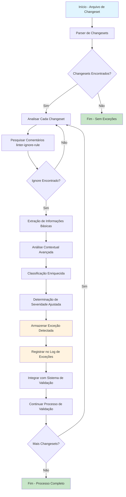

# Integração das Capacidades de Análise Contextual com o Fluxo de Detecção de Exceções

## 1. Visão Geral

Este documento define como integrar as capacidades de análise contextual automatizada desenvolvidas para agentes de IA no sistema de governança de changesets do Liquibase com o fluxo de detecção de exceções existente. A integração visa enriquecer o processo de detecção e classificação de exceções com informações contextuais avançadas.

## 2. Objetivos

- Integrar análise de tabelas temporárias/staging no fluxo de detecção
- Incorporar detecção de dados críticos na análise de risco
- Utilizar predições de impacto em cascata para classificação
- Aplicar análise de padrões de desenvolvedores na avaliação de risco
- Manter compatibilidade com o fluxo existente de detecção de exceções

## 3. Arquitetura de Integração

### 3.1. Posição no Pipeline de Detecção


### 3.2. Componentes de Análise Contextual
```
/exceptions/
├── detection/
│   ├── liquibase_ignore_detector.py    # Detector básico existente
│   ├── contextual_analyzer.py          # Novo: Analisador contextual integrado
│   ├── table_context_detector.py       # Detector de contexto de tabelas (de plans/table_analysis_capabilities.md)
│   ├── critical_data_detector.py       # Detector de dados críticos (de plans/critical_data_detection.md)
│   └── cascade_impact_predictor.py     # Preditor de impacto em cascata (de plans/cascade_impact_predictor.md)
├── classification/
│   ├── exception_classifier.py         # Classificador existente
│   ├── developer_pattern_analyzer.py   # Analisador de padrões de desenvolvedor (de plans/developer_pattern_analysis.md)
│   └── contextual_classifier.py        # Novo: Classificador contextual integrado
└── integration/
    └── detection_integrator.py         # Novo: Integrador do fluxo de detecção
```

## 4. Fluxo de Integração Detalhado

### 4.1. Análise Contextual Avançada
Quando um `linter-ignore-rule` é detectado, o sistema executa uma análise contextual avançada composta por:

1. **Análise de Tabelas Temporárias/Staging**
   - Identificação de operações em tabelas temporárias ou de staging
   - Avaliação do contexto de uso dessas tabelas
   - Classificação de risco associado

2. **Detecção de Dados Críticos**
   - Análise de nomes de colunas/tabelas para identificar dados sensíveis
   - Verificação de valores literais que possam conter informações críticas
   - Classificação do nível de criticidade dos dados envolvidos

3. **Predição de Impacto em Cascata**
   - Análise de dependências diretas e indiretas
   - Predição de impactos em performance
   - Avaliação de riscos de integridade referencial
   - Estimativa de possíveis tempos de downtime

4. **Análise de Padrões do Desenvolvedor**
   - Consulta ao histórico do desenvolvedor
   - Análise de frequência e qualidade das submissões
   - Avaliação de perfil de risco baseado em comportamentos passados

### 4.2. Classificação Enriquecida
A classificação da exceção é ajustada com base nas análises contextuais:

```python
@dataclass
class ContextualExceptionRecord(ExceptionRecord):
    table_context: Optional[TableContext]  # Informações sobre tabelas temporárias/staging
    critical_data_elements: List[CriticalDataElement]  # Elementos de dados críticos identificados
    cascade_impact_prediction: Optional[CascadeImpactPrediction]  # Predição de impacto em cascata
    developer_profile: Optional[DeveloperProfile]  # Perfil do desenvolvedor
    contextual_severity: str  # Severidade ajustada com base em contexto
    risk_factors: List[str]  # Fatores de risco identificados
```

## 5. Interface de Comunicação Estendida

### 5.1. Interface Estendida de Detecção
```python
class ContextualExceptionDetectionInterface(ExceptionDetectionInterface):
    def detect_contextual_exceptions(self, changeset_file: str) -> List[ContextualExceptionRecord]:
        """
        Detecta exceções linter-ignore-rule em um arquivo de changeset com análise contextual
        
        Args:
            changeset_file: Caminho para o arquivo de changeset
            
        Returns:
            Lista de registros de exceções detectadas com contexto adicional
        """
        pass
    
    def get_contextual_ignored_rules_for_changeset(self, author: str, id: str) -> Dict[str, Any]:
        """
        Obtém lista de regras ignoradas para um changeset específico com contexto adicional
        
        Args:
            author: Autor do changeset
            id: ID do changeset
            
        Returns:
            Dicionário com regras ignoradas e contexto adicional
        """
        pass
```

### 5.2. Serviço de Exceções Contextual
```python
class ContextualExceptionService(ExceptionService):
    def __init__(self, repository: ExceptionRepository, 
                 table_analyzer: TableContextAnalyzer,
                 data_detector: CriticalDataDetector,
                 impact_predictor: CascadeImpactPredictor,
                 developer_analyzer: DeveloperPatternAnalyzer):
        super().__init__(repository)
        self.table_analyzer = table_analyzer
        self.data_detector = data_detector
        self.impact_predictor = impact_predictor
        self.developer_analyzer = developer_analyzer
    
    def register_contextual_exception(self, exception_record: ContextualExceptionRecord):
        """Registra uma nova exceção detectada com contexto adicional"""
        # Enriquecer o registro com análises contextuais
        enriched_record = self._enrich_exception_with_context(exception_record)
        self.repository.save(enriched_record)
    
    def _enrich_exception_with_context(self, record: ExceptionRecord) -> ContextualExceptionRecord:
        """Enriquece uma exceção com análises contextuais"""
        # Realizar análises contextuais
        table_context = self.table_analyzer.analyze(record.file_name, record.line_number)
        critical_data = self.data_detector.detect(record.file_name)
        impact_prediction = self.impact_predictor.predict(record)
        developer_profile = self.developer_analyzer.get_profile(record.changeset_author)
        
        # Ajustar severidade com base no contexto
        contextual_severity = self._adjust_severity_based_on_context(
            record.severity, table_context, critical_data, impact_prediction, developer_profile
        )
        
        # Identificar fatores de risco
        risk_factors = self._identify_risk_factors(table_context, critical_data, impact_prediction)
        
        return ContextualExceptionRecord(
            exception_id=record.exception_id,
            changeset_author=record.changeset_author,
            changeset_id=record.changeset_id,
            file_name=record.file_name,
            line_number=record.line_number,
            rule_name=record.rule_name,
            exception_type=record.exception_type,
            severity=record.severity,
            detected_at=record.detected_at,
            environment=record.environment,
            justification=record.justification,
            status=record.status,
            table_context=table_context,
            critical_data_elements=critical_data,
            cascade_impact_prediction=impact_prediction,
            developer_profile=developer_profile,
            contextual_severity=contextual_severity,
            risk_factors=risk_factors
        )
```

## 6. Modificações no Detector de Exceções

### 6.1. Detector de Exceções Contextual
```python
class ContextualLiquibaseIgnoreDetector(LiquibaseIgnoreDetector):
    def __init__(self, exception_service: ContextualExceptionService):
        super().__init__(exception_service)
        self.contextual_analyzer = ContextualAnalyzer()
    
    def detect_in_file(self, file_path: str) -> List[ContextualExceptionRecord]:
        """Detecta exceções linter-ignore-rule em um arquivo com análise contextual"""
        exceptions = super().detect_in_file(file_path)
        contextual_exceptions = []
        
        for exception in exceptions:
            # Realizar análise contextual adicional
            contextual_exception = self.contextual_analyzer.enrich_exception(exception, file_path)
            contextual_exceptions.append(contextual_exception)
        
        return contextual_exceptions
```

## 7. Critérios de Classificação Ajustados

### 7.1. Fatores de Ajuste de Severidade
1. **Contexto de Tabelas**: Operações em tabelas temporárias/staging podem reduzir a severidade
2. **Dados Críticos**: Presença de dados sensíveis aumenta significativamente a severidade
3. **Impacto em Cascata**: Predições de alto impacto aumentam a severidade
4. **Perfil do Desenvolvedor**: Desenvolvedores com bom histórico podem ter redução de severidade
5. **Combinação de Fatores**: Múltiplos fatores de risco combinados podem elevar drasticamente a severidade

### 7.2. Matriz de Severidade Contextual
| Severidade Base | Tabelas Temp/Staging | Dados Críticos | Impacto Cascata | Perfil Dev | Severidade Ajustada |
|----------------|---------------------|----------------|-----------------|------------|---------------------|
| Baixa          | Sim                 | Não            | Baixo           | Bom        | Baixa               |
| Baixa          | Não                 | Sim            | Alto            | Ruim       | Alta                |
| Média          | Não                 | Sim            | Crítico         | Bom        | Alta                |
| Média          | Sim                 | Sim            | Médio           | Ruim       | Alta                |
| Alta           | Não                 | Sim            | Crítico         | Ruim       | Crítica             |
| Alta           | Não                 | Sim            | Crítico         | Bom        | Alta                |

## 8. Integração com Sistema de Validação

### 8.1. Comunicação de Contexto Adicional
O sistema de validação recebe informações contextuais adicionais que podem influenciar:

1. **Decisões de Aprovação**: Contexto pode justificar ou agravar a necessidade de aprovação manual
2. **Rotas de Aprovação**: Perfis de desenvolvedores podem direcionar para diferentes caminhos de aprovação
3. **Tempos de Timeout**: Risco mais alto pode exigir tempos de resposta mais curtos
4. **Notificações**: Stakeholders relevantes podem ser notificados com base no contexto

### 8.2. Interface de Validação Enriquecida
```python
class ContextualValidationEngine(ValidationEngine):
    def validate_changeset_file(self, file_path: str) -> ContextualValidationResult:
        # Detectar exceções com contexto adicional
        exceptions = self.contextual_exception_detector.detect_contextual_exceptions(file_path)
        
        # Registrar exceções para auditoria com contexto
        self._log_contextual_exceptions(exceptions)
        
        # Prosseguir com validação normal
        parsed_changesets = self.parser.parse(file_path)
        
        results = []
        for changeset in parsed_changesets:
            # Obter regras ignoradas com contexto para este changeset
            ignored_context = self.contextual_exception_detector.get_contextual_ignored_rules_for_changeset(
                changeset.author, changeset.id
            )
            
            # Validar com consideração às exceções e contexto
            result = self._validate_with_contextual_exceptions(changeset, ignored_context)
            results.append(result)
        
        return ContextualValidationResult(results, exceptions)
```

## 9. Considerações de Implementação

### 9.1. Performance
- As análises contextuais devem ser otimizadas para não impactar significativamente o tempo de detecção
- Implementar caching estratégico para análises repetidas
- Utilizar processamento assíncrono quando possível para análises mais pesadas

### 9.2. Resiliência
- O sistema deve continuar funcionando mesmo que algumas análises contextuais falhem
- Implementar fallbacks para classificações padrão quando análises contextuais não estiverem disponíveis
- Registrar falhas de análise contextual para investigação posterior

### 9.3. Extensibilidade
- O modelo de dados deve ser flexível para incorporar novas análises contextuais
- A interface de detecção deve permitir fácil adição de novos componentes analíticos
- O sistema de classificação deve ser configurável para ajustar pesos de diferentes fatores

## 10. Métricas de Monitoramento

### 10.1. Métricas de Integração
- Percentual de exceções enriquecidas com análise contextual
- Tempo médio de enriquecimento por exceção
- Taxa de sucesso das análises contextuais
- Número de decisões de severidade ajustadas

### 10.2. Métricas de Impacto
- Correlação entre severidade ajustada e incidentes reais
- Tempo médio para resolução de exceções com análise contextual
- Redução em mudanças problemáticas após implementação
- Feedback de usuários sobre utilidade das informações contextuais

### 10.3. Métricas de Performance
- Latência adicional introduzida pelas análises contextuais
- Utilização de recursos durante análises enriquecidas
- Escalabilidade do sistema com aumento de volume de changesets
- Eficiência do caching de análises contextuais