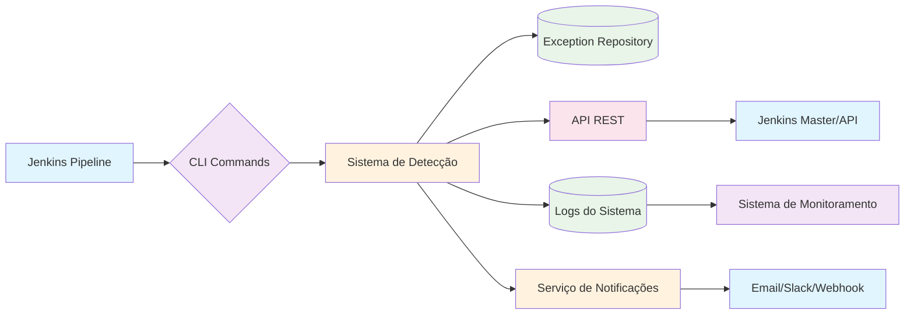

# Protocolo de Comunicação entre Sistema de Detecção e Jenkins

## 1. Visão Geral

Este documento especifica o protocolo de comunicação entre o sistema de detecção de exceções `linter-ignore-rule` e o pipeline Jenkins. O protocolo define os mecanismos, formatos e fluxos de dados necessários para uma integração eficaz e confiável.

## 2. Arquitetura de Comunicação

### 2.1 Componentes Envolvidos
1. **Sistema de Detecção** - Aplicação Python responsável por identificar e classificar exceções
2. **Jenkins Master** - Servidor Jenkins que orquestra os pipelines
3. **Jenkins Agents** - Nós de execução onde os jobs são executados
4. **API de Integração** - Interface REST para comunicação entre sistemas
5. **Sistema de Notificações** - Mecanismo de alertas e comunicação assíncrona

### 2.2 Diagrama de Arquitetura


## 3. Métodos de Comunicação

### 3.1 Comandos CLI (Command Line Interface)
Os comandos CLI oferecem a forma mais direta de integração com o pipeline Jenkins.

#### 3.1.1 Comando de Detecção Inicial
```bash
# Sintaxe
liquibase-governance detect-exceptions [OPTIONS]

# Opções disponíveis
--input-path PATH        # Caminho para os arquivos de changeset
--output-format FORMAT   # Formato de saída (json, xml, html) - padrão: json
--output-file FILE       # Arquivo de saída - padrão: stdout
--environment ENV        # Ambiente (dev, staging, prod)
--fail-on-find BOOL      # Falhar se exceções forem encontradas - padrão: false
--verbose BOOL           # Saída verbosa - padrão: false

# Exemplo de uso no Jenkinsfile
stage('Detectar Exceções') {
    steps {
        sh '''
            liquibase-governance detect-exceptions \
                --input-path src/main/resources/db/changelog \
                --output-file exceptions-report.json \
                --environment ${ENVIRONMENT} \
                --verbose true
        '''
    }
    post {
        always {
            // Publicar relatório HTML
            publishHTML([
                allowMissing: false,
                alwaysLinkToLastBuild: true,
                keepAll: true,
                reportDir: '.',
                reportFiles: 'exceptions-report.html',
                reportName: 'Relatório de Exceções'
            ])
        }
    }
}
```

#### 3.1.2 Comando de Avaliação de Aprovação
```bash
# Sintaxe
liquibase-governance evaluate-approval-need [OPTIONS]

# Opções disponíveis
--exceptions-file FILE   # Arquivo com relatório de exceções
--environment ENV        # Ambiente de implantação
--output-format FORMAT   # Formato de saída (json, text) - padrão: json
--fail-if-needed BOOL    # Falhar se aprovação for necessária - padrão: false

# Exemplo de uso no Jenkinsfile
stage('Avaliar Necessidade de Aprovação') {
    steps {
        script {
            def approvalResult = sh(
                script: '''
                    liquibase-governance evaluate-approval-need \
                        --exceptions-file exceptions-report.json \
                        --environment ${ENVIRONMENT} \
                        --output-format json
                ''',
                returnStdout: true
            ).trim()
            
            // Parse do resultado JSON
            def approvalData = readJSON text: approvalResult
            
            // Definir variáveis de ambiente para estágios subsequentes
            env.APPROVAL_NEEDED = approvalData.shouldPause.toString()
            env.REQUIRED_APPROVERS = approvalData.requiredApprovers.join(',')
            env.TIMEOUT_HOURS = approvalData.timeoutHours.toString()
        }
    }
}
```

#### 3.1.3 Comando de Registro de Aprovação
```bash
# Sintaxe
liquibase-governance record-approval [OPTIONS]

# Opções disponíveis
--exception-id ID        # ID da exceção aprovada
--decision DECISION      # Decisão (approve, reject)
--justification TEXT     # Justificativa da decisão
--approver USER          # Usuário que tomou a decisão
--timestamp TIME         # Timestamp da decisão - padrão: now

# Exemplo de uso após aprovação manual
stage('Registrar Aprovação') {
    steps {
        script {
            // Após input de aprovação do Jenkins
            sh '''
                liquibase-governance record-approval \
                    --exception-id ${EXCEPTION_ID} \
                    --decision approve \
                    --justification "${APPROVAL_JUSTIFICATION}" \
                    --approver ${APPROVER}
            '''
        }
    }
}
```

## 4. API REST para Integração Avançada

### 4.1 Endpoints Disponíveis

#### 4.1.1 Detecção de Exceções
```
POST /api/v1/exceptions/detect
Content-Type: application/json

{
  "files": ["file1.sql", "file2.xml"],
  "environment": "production",
  "buildInfo": {
    "jobName": "liquibase-validation",
    "buildNumber": 12345,
    "triggeredBy": "developer.name"
  }
}

Response:
{
  "scanId": "uuid-12345",
  "timestamp": "2026-02-02T15:30:00Z",
  "totalExceptions": 2,
  "exceptions": [...],
  "approvalRequired": true,
  "requiredApprovers": ["AD-GROUP"],
  "timeoutHours": 24
}
```

#### 4.1.2 Avaliação de Necessidade de Aprovação
```
POST /api/v1/approval/evaluate
Content-Type: application/json

{
  "exceptions": [...],
  "environment": "production",
  "projectId": "my-project"
}

Response:
{
  "shouldPause": true,
  "pauseType": "required",
  "requiredApprovers": ["AD-GROUP"],
  "timeoutHours": 24,
  "exceptionSummary": {
    "totalCount": 2,
    "bySeverity": {
      "critical": 1,
      "high": 1
    }
  }
}
```

#### 4.1.3 Registro de Decisão de Aprovação
```
POST /api/v1/approval/decide
Content-Type: application/json
Authorization: Bearer <token>

{
  "exceptionId": "exc-123",
  "decision": "approve",
  "justification": "Necessário para correção crítica",
  "approver": "admin.ad"
}

Response:
{
  "status": "success",
  "message": "Decisão registrada com sucesso",
  "nextSteps": "Pipeline pode continuar"
}
```

### 4.2 Cliente API para Jenkins
```groovy
// /ci-scripts/jenkins/governance_api_client.groovy
class GovernanceApiClient {
    private String baseUrl
    private String authToken
    
    GovernanceApiClient(String baseUrl, String authToken) {
        this.baseUrl = baseUrl
        this.authToken = authToken
    }
    
    def detectExceptions(files, environment, buildInfo) {
        def requestBody = [
            files: files,
            environment: environment,
            buildInfo: buildInfo
        ]
        
        def response = httpRequest(
            url: "${baseUrl}/api/v1/exceptions/detect",
            httpMode: 'POST',
            requestBody: toJson(requestBody),
            contentType: 'APPLICATION_JSON',
            customHeaders: [[name: 'Authorization', value: "Bearer ${authToken}"]]
        )
        
        return readJSON text: response.content
    }
    
    def evaluateApprovalNeed(exceptions, environment, projectId) {
        def requestBody = [
            exceptions: exceptions,
            environment: environment,
            projectId: projectId
        ]
        
        def response = httpRequest(
            url: "${baseUrl}/api/v1/approval/evaluate",
            httpMode: 'POST',
            requestBody: toJson(requestBody),
            contentType: 'APPLICATION_JSON',
            customHeaders: [[name: 'Authorization', value: "Bearer ${authToken}"]]
        )
        
        return readJSON text: response.content
    }
    
    def recordApproval(exceptionId, decision, justification, approver) {
        def requestBody = [
            exceptionId: exceptionId,
            decision: decision,
            justification: justification,
            approver: approver
        ]
        
        def response = httpRequest(
            url: "${baseUrl}/api/v1/approval/decide",
            httpMode: 'POST',
            requestBody: toJson(requestBody),
            contentType: 'APPLICATION_JSON',
            customHeaders: [[name: 'Authorization', value: "Bearer ${authToken}"]]
        )
        
        return readJSON text: response.content
    }
    
    private String toJson(obj) {
        return groovy.json.JsonBuilder(obj).toString()
    }
}
```

## 5. Formatos de Dados

### 5.1 Formato do Relatório de Exceções
```json
{
  "scanId": "uuid-v4",
  "timestamp": "ISO 8601 timestamp",
  "source": {
    "type": "liquibase-changeset",
    "files": ["file1.sql", "file2.xml"],
    "environment": "production"
  },
  "summary": {
    "totalExceptions": 0,
    "bySeverity": {
      "low": 0,
      "medium": 0,
      "high": 0,
      "critical": 0
    },
    "byCategory": {
      "security": 0,
      "governance": 0,
      "quality": 0,
      "performance": 0
    }
  },
  "exceptions": [
    {
      "id": "string",
      "type": "linter-ignore-rule",
      "changeset": {
        "author": "string",
        "id": "string",
        "fileName": "string",
        "filePath": "string"
      },
      "ignoredRule": {
        "name": "string",
        "category": "security|governance|quality|performance",
        "baseSeverity": "low|medium|high|critical"
      },
      "calculatedSeverity": "low|medium|high|critical",
      "location": {
        "lineNumber": 0,
        "columnNumber": 0
      },
      "context": {
        "beforeLines": ["string"],
        "exceptionLine": "string",
        "afterLines": ["string"]
      },
      "justification": "string",
      "detectedAt": "ISO 8601 timestamp",
      "environment": "development|staging|production",
      "status": "pending|approved|rejected|timeout",
      "approver": "string (quando aplicável)",
      "approvalTimestamp": "ISO 8601 timestamp (quando aplicável)"
    }
  ],
  "metadata": {
    "scannerVersion": "string",
    "schemaVersion": "string",
    "buildInfo": {
      "jobName": "string",
      "buildNumber": 0,
      "triggeredBy": "string"
    }
  }
}
```

### 5.2 Formato de Mensagens de Erro
```json
{
  "error": {
    "code": "ERROR_CODE",
    "message": "Mensagem de erro detalhada",
    "details": {
      "field": "valor",
      "context": "informações adicionais"
    },
    "timestamp": "ISO 8601 timestamp",
    "traceId": "uuid-v4"
  }
}
```

## 6. Protocolos de Segurança

### 6.1 Autenticação e Autorização
1. **Tokens JWT** para autenticação API
2. **OAuth 2.0** para integração mais complexa
3. **Certificados SSL/TLS** para todas as comunicações
4. **Controle de acesso baseado em roles** para endpoints

### 6.2 Criptografia de Dados
1. **HTTPS** obrigatório para todas as APIs
2. **Criptografia de dados sensíveis** em repouso
3. **Mascaramento de informações sensíveis** em logs

### 6.3 Rate Limiting e Throttling
```yaml
# /config/rate_limiting.yaml
rate_limits:
  anonymous:
    requests_per_minute: 10
    burst_limit: 5
  
  authenticated:
    requests_per_minute: 100
    burst_limit: 20
  
  ad_group:
    requests_per_minute: 500
    burst_limit: 100
  
  ip_blacklist:
    - 192.168.1.100
    - 10.0.0.0/8
```

## 7. Tratamento de Erros e Resiliência

### 7.1 Estratégias de Retry
```python
# /ci-scripts/jenkins/retry_strategy.py
import time
import random
from typing import Callable, Any

class RetryStrategy:
    def __init__(self, max_attempts=3, base_delay=1, max_delay=60, exponential_base=2):
        self.max_attempts = max_attempts
        self.base_delay = base_delay
        self.max_delay = max_delay
        self.exponential_base = exponential_base
    
    def execute_with_retry(self, func: Callable, *args, **kwargs) -> Any:
        """Executa função com estratégia de retry"""
        last_exception = None
        
        for attempt in range(self.max_attempts):
            try:
                return func(*args, **kwargs)
            except Exception as e:
                last_exception = e
                if attempt < self.max_attempts - 1:
                    delay = min(
                        self.base_delay * (self.exponential_base ** attempt) + random.uniform(0, 1),
                        self.max_delay
                    )
                    print(f"Tentativa {attempt + 1} falhou: {str(e)}. "
                          f"Aguardando {delay:.2f} segundos antes da próxima tentativa...")
                    time.sleep(delay)
                else:
                    print(f"Todas as {self.max_attempts} tentativas falharam.")
        
        raise last_exception

# Uso no cliente Jenkins
retry_strategy = RetryStrategy(max_attempts=3, base_delay=2)

def safe_api_call(client, method, *args, **kwargs):
    def call():
        return getattr(client, method)(*args, **kwargs)
    
    return retry_strategy.execute_with_retry(call)
```

### 7.2 Circuit Breaker Pattern
```python
# /ci-scripts/jenkins/circuit_breaker.py
import time
from enum import Enum

class CircuitState(Enum):
    CLOSED = "closed"
    OPEN = "open"
    HALF_OPEN = "half_open"

class CircuitBreaker:
    def __init__(self, failure_threshold=5, timeout=60):
        self.failure_threshold = failure_threshold
        self.timeout = timeout
        self.failure_count = 0
        self.last_failure_time = None
        self.state = CircuitState.CLOSED
    
    def call(self, func, *args, **kwargs):
        """Chama função com circuit breaker"""
        if self.state == CircuitState.OPEN:
            if time.time() - self.last_failure_time > self.timeout:
                self.state = CircuitState.HALF_OPEN
            else:
                raise Exception("Circuit breaker está aberto")
        
        try:
            result = func(*args, **kwargs)
            self.on_success()
            return result
        except Exception as e:
            self.on_failure()
            raise e
    
    def on_success(self):
        """Manipula sucesso"""
        self.failure_count = 0
        self.state = CircuitState.CLOSED
    
    def on_failure(self):
        """Manipula falha"""
        self.failure_count += 1
        self.last_failure_time = time.time()
        
        if self.failure_count >= self.failure_threshold:
            self.state = CircuitState.OPEN
```

## 8. Monitoramento e Logs

### 8.1 Estrutura de Logs de Comunicação
```json
{
  "timestamp": "2026-02-02T15:30:45.123Z",
  "level": "INFO",
  "component": "jenkins-integration",
  "operation": "detect_exceptions",
  "correlationId": "uuid-correlacao",
  "request": {
    "method": "CLI",
    "command": "liquibase-governance detect-exceptions",
    "parameters": {
      "inputPath": "/workspace/src/main/resources/db/changelog",
      "environment": "production"
    }
  },
  "response": {
    "durationMs": 1250,
    "exitCode": 0,
    "exceptionCount": 2
  },
  "metadata": {
    "jenkinsJob": "liquibase-validation-pipeline",
    "buildNumber": 12345,
    "node": "agent-node-01"
  }
}
```

### 8.2 Métricas de Comunicação
```python
# /monitoring/communication_metrics.py
from prometheus_client import Counter, Histogram, Gauge

class CommunicationMetrics:
    def __init__(self):
        self.api_requests_total = Counter(
            'api_requests_total',
            'Total de requisições API',
            ['endpoint', 'method', 'status']
        )
        
        self.cli_commands_total = Counter(
            'cli_commands_total',
            'Total de comandos CLI executados',
            ['command', 'status']
        )
        
        self.request_duration_seconds = Histogram(
            'request_duration_seconds',
            'Duração das requisições em segundos',
            ['type', 'operation']
        )
        
        self.integration_health = Gauge(
            'integration_health_status',
            'Status de saúde da integração (1=saudável, 0=não saudável)',
            ['integration_type']
        )
    
    def record_api_request(self, endpoint, method, status):
        self.api_requests_total.labels(
            endpoint=endpoint,
            method=method,
            status=status
        ).inc()
    
    def record_cli_command(self, command, status):
        self.cli_commands_total.labels(
            command=command,
            status=status
        ).inc()
    
    def record_request_duration(self, duration, req_type, operation):
        self.request_duration_seconds.labels(
            type=req_type,
            operation=operation
        ).observe(duration)
    
    def set_integration_health(self, health_status, integration_type):
        self.integration_health.labels(
            integration_type=integration_type
        ).set(1 if health_status else 0)
```

## 9. Configuração e Deploy

### 9.1 Configuração do Cliente Jenkins
```groovy
// /ci-scripts/jenkins/config.groovy
node {
    def config = [
        governanceApi: [
            baseUrl: 'https://governance.company.com',
            authToken: '${GOVERNANCE_API_TOKEN}',
            timeoutSeconds: 300
        ],
        cliCommands: [
            basePath: '/usr/local/bin',
            version: '1.2.3'
        ],
        retryPolicy: [
            maxAttempts: 3,
            baseDelaySeconds: 2,
            maxDelaySeconds: 60
        ],
        notification: [
            email: [
                enabled: true,
                smtpServer: 'smtp.company.com',
                sender: 'jenkins-notifications@company.com'
            ],
            slack: [
                enabled: true,
                webhookUrl: '${SLACK_WEBHOOK_URL}'
            ]
        ]
    ]
    
    // Salvar configuração
    writeFile file: 'governance-config.json', text: groovy.json.JsonBuilder(config).toString()
}
```

### 9.2 Pipeline de Integração Completo
```groovy
// Jenkinsfile completo com integração
pipeline {
    agent any
    
    environment {
        GOVERNANCE_API_TOKEN = credentials('governance-api-token')
        SLACK_WEBHOOK_URL = credentials('slack-webhook-url')
        ENVIRONMENT = 'production'
    }
    
    stages {
        stage('Inicialização') {
            steps {
                script {
                    // Configurar cliente de integração
                    sh 'cp /ci-scripts/jenkins/* .'
                    sh './setup-governance-client.sh'
                }
            }
        }
        
        stage('Detecção de Exceções') {
            steps {
                script {
                    def client = new GovernanceApiClient(
                        'https://governance.company.com',
                        env.GOVERNANCE_API_TOKEN
                    )
                    
                    def scanResult = client.detectExceptions(
                        ['src/main/resources/db/changelog/**/*.*'],
                        env.ENVIRONMENT,
                        [
                            jobName: env.JOB_NAME,
                            buildNumber: env.BUILD_NUMBER,
                            triggeredBy: env.CHANGE_AUTHOR ?: 'unknown'
                        ]
                    )
                    
                    // Salvar resultados para estágios subsequentes
                    writeFile file: 'scan-result.json', text: groovy.json.JsonBuilder(scanResult).toString()
                    
                    // Publicar relatório HTML
                    publishHTML([
                        allowMissing: false,
                        alwaysLinkToLastBuild: true,
                        keepAll: true,
                        reportDir: '.',
                        reportFiles: 'exceptions-report.html',
                        reportName: 'Relatório de Exceções'
                    ])
                }
            }
            post {
                failure {
                    script {
                        // Notificar sobre falha na detecção
                        slackSend(
                            channel: '#dev-notifications',
                            message: "Falha na detecção de exceções para build ${env.BUILD_NUMBER}"
                        )
                    }
                }
            }
        }
        
        stage('Avaliação de Aprovação') {
            steps {
                script {
                    def scanResult = readJSON file: 'scan-result.json'
                    
                    if (scanResult.summary.totalExceptions > 0) {
                        def client = new GovernanceApiClient(
                            'https://governance.company.com',
                            env.GOVERNANCE_API_TOKEN
                        )
                        
                        def approvalResult = client.evaluateApprovalNeed(
                            scanResult.exceptions,
                            env.ENVIRONMENT,
                            'my-project'
                        )
                        
                        if (approvalResult.shouldPause) {
                            // Configurar variáveis para estágio de aprovação
                            env.APPROVAL_REQUIRED = 'true'
                            env.REQUIRED_APPROVERS = approvalResult.requiredApprovers.join(',')
                            env.TIMEOUT_HOURS = approvalResult.timeoutHours.toString()
                            
                            echo "Aprovação necessária por: ${env.REQUIRED_APPROVERS}"
                        } else {
                            env.APPROVAL_REQUIRED = 'false'
                        }
                    } else {
                        env.APPROVAL_REQUIRED = 'false'
                    }
                }
            }
        }
        
        stage('Aprovação Manual') {
            when {
                expression { env.APPROVAL_REQUIRED == 'true' }
            }
            steps {
                script {
                    def approvers = env.REQUIRED_APPROVERS.split(',').collect { "GROUP:${it.trim()}" }.join(',')
                    def timeoutHours = Integer.parseInt(env.TIMEOUT_HOURS)
                    
                    timeout(time: timeoutHours, unit: 'HOURS') {
                        def approvalInput = input(
                            message: "Exceções críticas encontradas. Aprovação necessária.",
                            submitter: approvers,
                            parameters: [
                                choice(
                                    choices: ['Aprovar', 'Rejeitar'],
                                    description: 'Decisão sobre as exceções encontradas',
                                    name: 'DECISION'
                                ),
                                text(
                                    defaultValue: '',
                                    description: 'Justificativa detalhada para a decisão',
                                    name: 'JUSTIFICATION'
                                )
                            ]
                        )
                        
                        // Registrar decisão
                        def client = new GovernanceApiClient(
                            'https://governance.company.com',
                            env.GOVERNANCE_API_TOKEN
                        )
                        
                        // Aqui você registraria cada exceção individualmente
                        // Para simplificar, assumindo que todas são aprovadas/rejeitadas juntas
                        
                        if (approvalInput.DECISION == 'Rejeitar') {
                            error("Build rejeitado por aprovação negativa: ${approvalInput.JUSTIFICATION}")
                        }
                        
                        echo "Aprovação registrada: ${approvalInput.DECISION}"
                    }
                }
            }
            post {
                aborted {
                    script {
                        echo "Timeout atingido para aprovação"
                        error("Timeout de ${env.TIMEOUT_HOURS} horas atingido para aprovação")
                    }
                }
            }
        }
        
        stage('Continuação do Pipeline') {
            steps {
                script {
                    echo "Pipeline continuando após avaliação de exceções"
                    // Continuar com os estágios normais do pipeline
                }
            }
        }
    }
    
    post {
        always {
            script {
                // Limpar recursos temporários
                sh 'rm -f governance-config.json scan-result.json || true'
            }
        }
        success {
            script {
                slackSend(
                    channel: '#dev-notifications',
                    message: "Build ${env.BUILD_NUMBER} completado com sucesso"
                )
            }
        }
        failure {
            script {
                slackSend(
                    channel: '#dev-notifications',
                    message: "Build ${env.BUILD_NUMBER} falhou"
                )
            }
        }
    }
}
```

## 10. Troubleshooting e Diagnóstico

### 10.1 Comandos de Diagnóstico CLI
```bash
# Verificar conectividade com o serviço
liquibase-governance health-check

# Testar configuração
liquibase-governance validate-config --config-file governance-config.yaml

# Listar exceções pendentes de aprovação
liquibase-governance list-pending-approvals --environment production

# Forçar reprocessamento de exceções
liquibase-governance reprocess-exceptions --scan-id uuid-12345
```

### 10.2 Script de Diagnóstico Jenkins
```bash
#!/bin/bash
# /ci-scripts/jenkins/diagnose-integration.sh

echo "=== Diagnóstico de Integração com Sistema de Governança ==="

# 1. Verificar presença do CLI
if ! command -v liquibase-governance &> /dev/null; then
    echo "❌ CLI liquibase-governance não encontrado"
    exit 1
else
    echo "✅ CLI liquibase-governance encontrado"
    liquibase-governance --version
fi

# 2. Verificar conectividade com API
echo "🔍 Testando conectividade com API..."
API_BASE_URL="https://governance.company.com"
if curl -s --connect-timeout 10 --max-time 30 -f "$API_BASE_URL/health" > /dev/null; then
    echo "✅ API acessível"
else
    echo "❌ Falha ao conectar-se à API"
    exit 1
fi

# 3. Verificar token de autenticação
if [ -z "$GOVERNANCE_API_TOKEN" ]; then
    echo "❌ Token de API não configurado"
    exit 1
else
    echo "✅ Token de API configurado"
fi

# 4. Verificar permissões de arquivo
TEST_DIR="/tmp/governance-test"
mkdir -p "$TEST_DIR"
if [ $? -eq 0 ]; then
    echo "✅ Permissões de escrita OK"
    rm -rf "$TEST_DIR"
else
    echo "❌ Sem permissões de escrita"
fi

# 5. Testar comando básico
echo "🧪 Testando comando de detecção..."
liquibase-governance detect-exceptions --help > /dev/null 2>&1
if [ $? -eq 0 ]; then
    echo "✅ Comando detect-exceptions funcionando"
else
    echo "❌ Falha no comando detect-exceptions"
fi

echo "=== Diagnóstico concluído ==="
```

Este protocolo de comunicação fornece uma base sólida para a integração entre o sistema de detecção de exceções e o Jenkins, garantindo eficiência, segurança e resiliência na comunicação entre os sistemas.