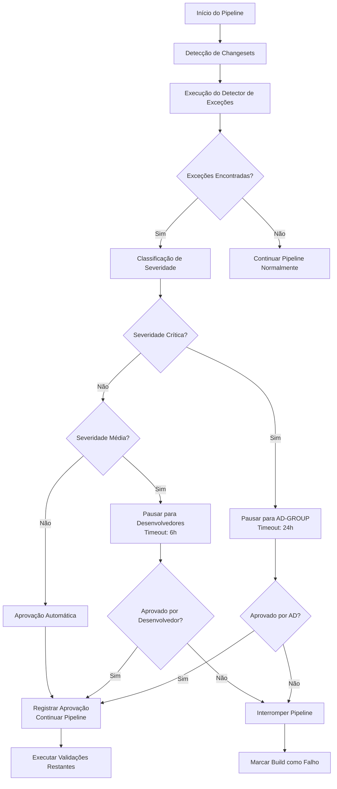

# Plano de Integração com Jenkins para Changesets com linter-ignore-rule

## 1. Visão Geral

Este documento detalha o plano de integração do sistema de detecção e aprovação de changesets com linter-ignore-rule no pipeline Jenkins. O objetivo é criar pontos de integração estratégicos que permitam a pausa condicional do pipeline, aprovação manual quando necessário e continuação automática quando aprovado.

## 2. Pontos de Integração no Pipeline Jenkins

### 2.1 Estágio de Pré-Validação
```groovy
stage('Pré-Validação de Changesets') {
    steps {
        script {
            // Executar detector de linter-ignore-rule
            sh 'liquibase-governance detect-exceptions --input-file=${CHANGESET_FILE}'
            
            // Verificar se há exceções que requerem aprovação
            def approvalNeeded = sh(
                script: 'liquibase-governance check-approval-needed --input-file=${CHANGESET_FILE}',
                returnStdout: true
            ).trim()
            
            if (approvalNeeded == 'true') {
                env.APPROVAL_REQUIRED = 'true'
            } else {
                env.APPROVAL_REQUIRED = 'false'
            }
        }
    }
}
```

### 2.2 Estágio de Detecção de Exceções
```groovy
stage('Detecção de Exceções linter-ignore-rule') {
    when {
        expression { env.CHANGESET_TYPE == 'liquibase' }
    }
    steps {
        script {
            // Executar detector específico para linter-ignore-rule
            def detectionResult = sh(
                script: 'liquibase-governance detect-linter-exceptions --input-dir=${WORKSPACE}/src/main/resources/db/changelog',
                returnStdout: true
            )
            
            // Salvar resultado para estágios posteriores
            writeFile file: 'linter-exceptions-report.json', text: detectionResult
            
            // Registrar exceções detectadas no sistema de logs
            sh 'liquibase-governance log-exceptions --report-file=linter-exceptions-report.json'
        }
    }
    post {
        always {
            // Publicar relatório de exceções
            publishHTML([
                allowMissing: false,
                alwaysLinkToLastBuild: true,
                keepAll: true,
                reportDir: '.',
                reportFiles: 'linter-exceptions-report.html',
                reportName: 'Relatório de Exceções linter-ignore-rule'
            ])
        }
    }
}
```

### 2.3 Estágio Condicionais de Pausa/Aprovação

#### 2.3.1 Pausa para Severidade Alta/Crítica
```groovy
stage('Aprovação para Exceções Críticas') {
    when {
        expression { 
            sh(script: 'liquibase-governance has-critical-exceptions --report-file=linter-exceptions-report.json', returnStatus: true) == 0 
        }
    }
    steps {
        timeout(time: 24, unit: 'HOURS') {
            input(
                message: 'Changeset contém exceções críticas que requerem aprovação',
                submitter: 'AD-GROUP',
                parameters: [
                    choice(
                        choices: ['Aprovar', 'Rejeitar'],
                        description: 'Decisão sobre as exceções críticas encontradas',
                        name: 'DECISION'
                    ),
                    text(
                        defaultValue: '',
                        description: 'Justificativa para a decisão',
                        name: 'JUSTIFICATION'
                    )
                ]
            )
        }
        
        script {
            // Registrar decisão de aprovação
            def decision = params.DECISION
            def justification = params.JUSTIFICATION
            
            if (decision == 'Rejeitar') {
                error("Changeset rejeitado devido a exceções críticas: ${justification}")
            }
            
            // Registrar aprovação no sistema
            sh "liquibase-governance record-approval --decision=${decision} --justification='${justification}' --approver=${env.BUILD_USER}"
        }
    }
}
```

#### 2.3.2 Pausa para Severidade Média
```groovy
stage('Aprovação para Exceções de Média Severidade') {
    when {
        expression { 
            sh(script: 'liquibase-governance has-medium-exceptions --report-file=linter-exceptions-report.json', returnStatus: true) == 0 &&
            sh(script: 'liquibase-governance has-critical-exceptions --report-file=linter-exceptions-report.json', returnStatus: true) != 0
        }
    }
    steps {
        timeout(time: 6, unit: 'HOURS') {
            input(
                message: 'Changeset contém exceções de média severidade que requerem revisão',
                submitter: 'DEVELOPERS,TEAM-LEADS',
                parameters: [
                    choice(
                        choices: ['Aprovar', 'Rejeitar', 'Solicitar Alterações'],
                        description: 'Decisão sobre as exceções de média severidade encontradas',
                        name: 'DECISION'
                    ),
                    text(
                        defaultValue: '',
                        description: 'Justificativa para a decisão',
                        name: 'JUSTIFICATION'
                    )
                ]
            )
        }
        
        script {
            def decision = params.DECISION
            def justification = params.JUSTIFICATION
            
            if (decision == 'Rejeitar' || decision == 'Solicitar Alterações') {
                error("Changeset precisa de alterações: ${justification}")
            }
            
            // Registrar aprovação
            sh "liquibase-governance record-approval --decision=${decision} --justification='${justification}' --approver=${env.BUILD_USER}"
        }
    }
}
```

## 3. Mecanismo de Pausa Condicional

### 3.1 Critérios de Pausa
O mecanismo de pausa será acionado com base na severidade das exceções detectadas:

1. **Severidade Crítica (Alta)**:
   - Pausa obrigatória
   - Aprovação exclusiva do grupo AD-GROUP
   - Timeout de 24 horas

2. **Severidade Média**:
   - Pausa para revisão
   - Aprovação de desenvolvedores sênior ou team leads
   - Timeout de 6 horas

3. **Severidade Baixa**:
   - Sem pausa
   - Registro para auditoria
   - Aprovação automática

### 3.2 Implementação do Decisor de Pausa
```python
# /ci-scripts/jenkins/approval_gate.py
import json
import sys
from enum import Enum

class SeverityLevel(Enum):
    LOW = "low"
    MEDIUM = "medium"
    HIGH = "high"
    CRITICAL = "critical"

class ApprovalGate:
    def __init__(self, exceptions_report_file):
        self.exceptions_report = self._load_report(exceptions_report_file)
    
    def _load_report(self, file_path):
        with open(file_path, 'r') as f:
            return json.load(f)
    
    def should_pause_pipeline(self):
        """Determina se o pipeline deve ser pausado"""
        max_severity = self._get_max_severity()
        
        if max_severity in [SeverityLevel.HIGH, SeverityLevel.CRITICAL]:
            return True
        elif max_severity == SeverityLevel.MEDIUM:
            return True
        else:
            return False
    
    def get_required_approvers(self):
        """Retorna os grupos de usuários que podem aprovar"""
        max_severity = self._get_max_severity()
        
        if max_severity in [SeverityLevel.HIGH, SeverityLevel.CRITICAL]:
            return "AD-GROUP"
        elif max_severity == SeverityLevel.MEDIUM:
            return "DEVELOPERS,TEAM-LEADS"
        else:
            return "AUTO-APPROVED"
    
    def get_timeout_duration(self):
        """Retorna o timeout apropriado em horas"""
        max_severity = self._get_max_severity()
        
        if max_severity in [SeverityLevel.HIGH, SeverityLevel.CRITICAL]:
            return 24
        elif max_severity == SeverityLevel.MEDIUM:
            return 6
        else:
            return 1  # Para aprovação automática
    
    def _get_max_severity(self):
        """Calcula a severidade máxima entre todas as exceções"""
        severities = []
        for exception in self.exceptions_report.get('exceptions', []):
            severities.append(SeverityLevel(exception.get('severity', 'low')))
        
        if SeverityLevel.CRITICAL in severities:
            return SeverityLevel.CRITICAL
        elif SeverityLevel.HIGH in severities:
            return SeverityLevel.HIGH
        elif SeverityLevel.MEDIUM in severities:
            return SeverityLevel.MEDIUM
        else:
            return SeverityLevel.LOW
```

## 4. Interface de Aprovação para Grupo AD

### 4.1 Painel de Aprovação Web
Será criado um painel web simples para visualização e aprovação de exceções:

```html
<!-- /ci-scripts/jenkins/approval_template.html -->
<div class="exception-approval-panel">
    <h2>Exceções linter-ignore-rule Requerendo Aprovação</h2>
    
    <div th:each="exception : ${exceptions}" class="exception-item">
        <div class="exception-header">
            <span class="severity-badge" th:classappend="${exception.severity}">
                Severidade: [[${exception.severity}]]
            </span>
            <span class="rule-name">Regra: [[${exception.ruleName}]]</span>
        </div>
        
        <div class="exception-details">
            <p><strong>Changeset:</strong> [[${exception.changeset.author}]]:[[${exception.changeset.id}]]</p>
            <p><strong>Arquivo:</strong> [[${exception.fileName}]] (linha [[${exception.lineNumber}]])</p>
            <p><strong>Justificativa do Desenvolvedor:</strong> [[${exception.developerJustification}]]</p>
        </div>
        
        <div class="approval-actions">
            <button class="approve-btn" onclick="approveException([[${exception.id}]])">Aprovar</button>
            <button class="reject-btn" onclick="rejectException([[${exception.id}]])">Rejeitar</button>
            <textarea placeholder="Justificativa para a decisão..." id="justification-[[${exception.id}]]></textarea>
        </div>
    </div>
</div>
```

### 4.2 API de Aprovação
```python
# /ci-scripts/jenkins/approval_api.py
from flask import Flask, request, jsonify
from exceptions.exception_service import ExceptionService

app = Flask(__name__)
exception_service = ExceptionService()

@app.route('/api/exceptions/pending-approvals')
def get_pending_approvals():
    """Obtém lista de exceções aguardando aprovação"""
    pending_exceptions = exception_service.get_pending_approvals()
    return jsonify(pending_exceptions)

@app.route('/api/exceptions/<exception_id>/approve', methods=['POST'])
def approve_exception(exception_id):
    """Aprova uma exceção"""
    justification = request.json.get('justification')
    approver = request.json.get('approver')
    
    try:
        exception_service.approve_exception(exception_id, justification, approver)
        return jsonify({"status": "success", "message": "Exceção aprovada"})
    except Exception as e:
        return jsonify({"status": "error", "message": str(e)}), 400

@app.route('/api/exceptions/<exception_id>/reject', methods=['POST'])
def reject_exception(exception_id):
    """Rejeita uma exceção"""
    justification = request.json.get('justification')
    approver = request.json.get('approver')
    
    try:
        exception_service.reject_exception(exception_id, justification, approver)
        return jsonify({"status": "success", "message": "Exceção rejeitada"})
    except Exception as e:
        return jsonify({"status": "error", "message": str(e)}), 400
```

## 5. Protocolo de Comunicação com Jenkins

### 5.1 Comandos CLI para Integração
Serão criados comandos CLI específicos para integração com Jenkins:

```bash
# Detecção de exceções
liquibase-governance detect-linter-exceptions --input-dir=/caminho/para/changesets

# Verificação se aprovação é necessária
liquibase-governance check-approval-needed --exceptions-report=report.json

# Verificação de exceções críticas
liquibase-governance has-critical-exceptions --exceptions-report=report.json

# Registro de aprovação
liquibase-governance record-approval --exception-id=123 --decision=approve --justification="Necessário para correção de bug crítico" --approver=usuario.ad

# Geração de relatórios
liquibase-governance generate-approval-report --format=html --output=approval-report.html
```

### 5.2 Formatos de Comunicação

#### 5.2.1 Formato do Relatório de Exceções
```json
{
  "scanId": "uuid-12345",
  "timestamp": "2026-02-02T15:30:00Z",
  "totalExceptions": 2,
  "exceptions": [
    {
      "id": "exc-001",
      "changeset": {
        "author": "dev.junior",
        "id": "migration-drop-temp-tables",
        "fileName": "db/changelog/v1.2.0/001-drop-temp-tables.xml"
      },
      "ignoredRule": {
        "name": "no-drop-table",
        "category": "security",
        "baseSeverity": "high"
      },
      "calculatedSeverity": "high",
      "lineNumber": 15,
      "detectedAt": "2026-02-02T15:30:00Z",
      "justification": "Remoção necessária de tabelas temporárias criadas durante processos batch",
      "status": "pending_approval"
    }
  ],
  "recommendations": [
    {
      "type": "approval_required",
      "targetGroup": "AD-GROUP",
      "severity": "high",
      "reason": "Exceção de segurança crítica detectada"
    }
  ]
}
```

## 6. Fluxo de Continuação/Interrupção do Pipeline

### 6.1 Fluxo Completo de Integração


### 6.2 Tratamento de Timeouts
```groovy
stage('Aprovação com Timeout') {
    steps {
        timeout(time: 6, unit: 'HOURS') {
            input(
                message: 'Aguardando aprovação para exceções de média severidade',
                submitter: 'DEVELOPERS,TEAM-LEADS'
            )
        }
    }
    post {
        aborted {
            script {
                // Timeout atingido
                echo 'Tempo limite para aprovação excedido'
                sh 'liquibase-governance record-timeout --reason="Timeout de aprovação"'
                error('Pipeline interrompido devido ao timeout de aprovação')
            }
        }
    }
}
```

## 7. Notificação de Exceções Críticas

### 7.1 Sistema de Notificações
```python
# /ci-scripts/jenkins/notification_hooks.py
import smtplib
from email.mime.text import MIMEText
from email.mime.multipart import MIMEMultipart

class NotificationService:
    def __init__(self, config):
        self.smtp_server = config.get('smtp_server')
        self.smtp_port = config.get('smtp_port')
        self.sender_email = config.get('sender_email')
        self.ad_group_emails = config.get('ad_group_emails', [])
    
    def notify_critical_exceptions(self, exceptions_report):
        """Notifica o grupo AD sobre exceções críticas"""
        if not self._has_critical_exceptions(exceptions_report):
            return
        
        subject = "🚨 Exceções Críticas linter-ignore-rule Requerem Aprovação"
        body = self._generate_notification_body(exceptions_report)
        
        self._send_email(self.ad_group_emails, subject, body)
    
    def _has_critical_exceptions(self, report):
        """Verifica se há exceções críticas no relatório"""
        for exception in report.get('exceptions', []):
            if exception.get('calculatedSeverity') in ['high', 'critical']:
                return True
        return False
    
    def _generate_notification_body(self, report):
        """Gera o corpo do email de notificação"""
        body = "Foram detectadas exceções críticas que requerem sua aprovação:\n\n"
        
        for exception in report.get('exceptions', []):
            if exception.get('calculatedSeverity') in ['high', 'critical']:
                body += f"- Changeset: {exception['changeset']['author']}:{exception['changeset']['id']}\n"
                body += f"  Regra: {exception['ignoredRule']['name']}\n"
                body += f"  Severidade: {exception['calculatedSeverity']}\n"
                body += f"  Justificativa: {exception.get('justification', 'N/A')}\n\n"
        
        body += f"Por favor, acesse o pipeline Jenkins para aprovar ou rejeitar estas exceções.\n"
        body += f"Link: {report.get('jenkins_build_url', 'N/A')}\n"
        
        return body
    
    def _send_email(self, recipients, subject, body):
        """Envia email de notificação"""
        msg = MIMEMultipart()
        msg['From'] = self.sender_email
        msg['To'] = ', '.join(recipients)
        msg['Subject'] = subject
        
        msg.attach(MIMEText(body, 'plain'))
        
        try:
            server = smtplib.SMTP(self.smtp_server, self.smtp_port)
            server.starttls()
            # server.login(self.sender_email, password)  # Se necessário
            text = msg.as_string()
            server.sendmail(self.sender_email, recipients, text)
            server.quit()
        except Exception as e:
            print(f"Erro ao enviar notificação: {e}")
```

## 8. Políticas de Timeout

### 8.1 Configuração de Timeouts
```yaml
# /ci-scripts/jenkins/timeout_config.yaml
approval_timeouts:
  critical:
    duration: 24
    unit: hours
    reminder_interval: 6  # horas
  
  medium:
    duration: 6
    unit: hours
    reminder_interval: 2  # horas
  
  low:
    duration: 1
    unit: hours
    reminder_interval: 30  # minutos

reminder_settings:
  enabled: true
  smtp_config:
    server: smtp.empresa.com
    port: 587
    sender: jenkins-notifications@empresa.com
```

### 8.2 Sistema de Lembretes
```python
# /ci-scripts/jenkins/reminder_service.py
import time
from datetime import datetime, timedelta

class ReminderService:
    def __init__(self, notification_service, timeout_config):
        self.notification_service = notification_service
        self.timeout_config = timeout_config
        self.pending_approvals = {}
    
    def schedule_reminder(self, exception_id, severity, approvers, due_time):
        """Agenda lembretes para aprovações pendentes"""
        self.pending_approvals[exception_id] = {
            'severity': severity,
            'approvers': approvers,
            'due_time': due_time,
            'last_reminded': None
        }
    
    def check_and_send_reminders(self):
        """Verifica e envia lembretes para aprovações pendentes"""
        now = datetime.now()
        
        for exception_id, approval_info in self.pending_approvals.items():
            due_time = approval_info['due_time']
            last_reminded = approval_info['last_reminded']
            severity = approval_info['severity']
            
            # Verificar se está próximo do vencimento
            reminder_config = self.timeout_config['reminder_settings'][severity]
            reminder_time = due_time - timedelta(hours=reminder_config['hours_before'])
            
            if now >= reminder_time and (last_reminded is None or now >= last_reminded + timedelta(hours=reminder_config['interval'])):
                self._send_reminder(exception_id, approval_info)
                approval_info['last_reminded'] = now
    
    def _send_reminder(self, exception_id, approval_info):
        """Envia lembrete para os aprovadores"""
        subject = f"⏰ Lembrete: Aprovação Pendente para Exceção {exception_id}"
        body = f"""
        Este é um lembrete de que a exceção {exception_id} ainda aguarda sua aprovação.
        
        Prazo para aprovação: {approval_info['due_time']}
        Severidade: {approval_info['severity']}
        
        Por favor, acesse o pipeline Jenkins para tomar uma decisão.
        """
        
        self.notification_service._send_email(
            approval_info['approvers'], 
            subject, 
            body
        )
```

## 9. Logs e Auditoria

### 9.1 Estrutura de Logs Específicos para Aprovação
```python
# /logs/approval_audit.log
{
  "timestamp": "2026-02-02T15:45:30Z",
  "eventType": "exception_approval_requested",
  "exceptionId": "exc-001",
  "changeset": "dev.junior:migration-drop-temp-tables",
  "severity": "high",
  "rule": "no-drop-table",
  "requester": "jenkins-pipeline-12345",
  "targetApprovers": ["AD-GROUP"]
}

{
  "timestamp": "2026-02-02T16:20:15Z",
  "eventType": "exception_approved",
  "exceptionId": "exc-001",
  "approver": "admin.ad",
  "justification": "Exceção aprovada após validação de necessidade de negócio",
  "pipelineBuild": "liquibase-validation-pipeline#12345"
}

{
  "timestamp": "2026-02-03T15:45:30Z",
  "eventType": "approval_timeout",
  "exceptionId": "exc-001",
  "reason": "Timeout de 24 horas atingido sem aprovação",
  "pipelineBuild": "liquibase-validation-pipeline#12345"
}
```

### 9.2 Dashboard de Auditoria
Será criado um dashboard para acompanhamento das aprovações:

```html
<!-- /ci-scripts/jenkins/dashboard_template.html -->
<div class="approval-dashboard">
    <div class="dashboard-header">
        <h1>Dashboard de Aprovações de Exceções</h1>
        <div class="time-filter">
            <select onchange="filterByTime(this.value)">
                <option value="24h">Últimas 24 horas</option>
                <option value="7d">Últimos 7 dias</option>
                <option value="30d">Últimos 30 dias</option>
            </select>
        </div>
    </div>
    
    <div class="metrics-summary">
        <div class="metric-card">
            <h3>Pendentes</h3>
            <span class="count" id="pending-count">5</span>
        </div>
        <div class="metric-card">
            <h3>Aprovadas</h3>
            <span class="count" id="approved-count">23</span>
        </div>
        <div class="metric-card">
            <h3>Rejeitadas</h3>
            <span class="count" id="rejected-count">2</span>
        </div>
        <div class="metric-card">
            <h3>Timeout</h3>
            <span class="count" id="timeout-count">1</span>
        </div>
    </div>
    
    <div class="recent-approvals">
        <h2>Aprovações Recentes</h2>
        <table>
            <thead>
                <tr>
                    <th>ID da Exceção</th>
                    <th>Changeset</th>
                    <th>Regra</th>
                    <th>Aprovador</th>
                    <th>Data/Hora</th>
                    <th>Status</th>
                </tr>
            </thead>
            <tbody id="approvals-table-body">
                <!-- Dados carregados dinamicamente -->
            </tbody>
        </table>
    </div>
</div>
```

## 10. Considerações de Segurança

### 10.1 Controle de Acesso
- Apenas membros do grupo AD-GROUP podem aprovar exceções críticas
- Aprovações são registradas com timestamp e identificação do aprovador
- Todos os acessos ao sistema de aprovação são auditados

### 10.2 Proteção contra Abuso
- Limites de exceções por autor em um período
- Monitoramento de padrões suspeitos de uso
- Revisão obrigatória para certas categorias de exceções

## 11. Próximos Passos

1. **Implementação dos componentes de detecção** no módulo `/ci-scripts/jenkins/`
2. **Criação dos comandos CLI** para integração com Jenkins
3. **Desenvolvimento da interface web** para aprovações
4. **Configuração do sistema de notificações**
5. **Implementação dos testes de integração**
6. **Documentação dos procedimentos de uso**

Este plano fornece uma base sólida para a integração completa do sistema de governança com o pipeline Jenkins, garantindo controle adequado sobre exceções linter-ignore-rule enquanto mantém a eficiência do processo de CI/CD.