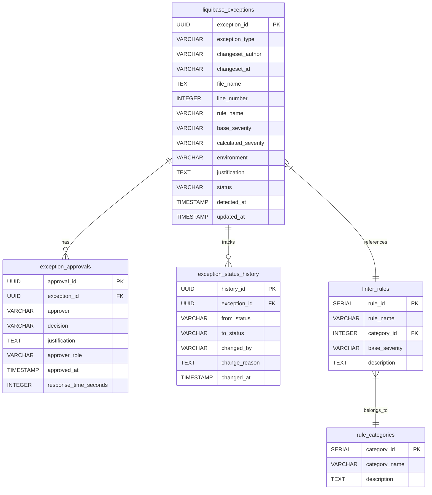

# Modelo de Dados para Auditoria de Exceções do Liquibase

## Visão Geral

Este documento descreve o modelo de dados para auditoria de exceções `linter-ignore-rule` em changesets do Liquibase. O esquema foi projetado especificamente para rastrear, classificar e auditar todas as exceções detectadas no sistema de governança.

## Estrutura do Banco de Dados

### Tabela Principal: `liquibase_exceptions`

Esta tabela registra todas as exceções `linter-ignore-rule` detectadas nos changesets do Liquibase.

#### Campos

| Nome | Tipo | Restrições | Descrição |
|------|------|------------|-----------|
| `exception_id` | UUID | PRIMARY KEY | Identificador único da exceção |
| `exception_type` | VARCHAR(20) | NOT NULL, CHECK ('specific', 'all', 'malformed') | Tipo de exceção: específica, geral ou malformada |
| `changeset_author` | VARCHAR(100) | NOT NULL | Autor do changeset onde a exceção foi detectada |
| `changeset_id` | VARCHAR(200) | NOT NULL | ID do changeset onde a exceção foi detectada |
| `file_name` | TEXT | NOT NULL | Nome/caminho do arquivo do changeset |
| `line_number` | INTEGER | NOT NULL | Número da linha onde a exceção foi detectada |
| `rule_name` | VARCHAR(100) | | Nome da regra ignorada (NULL para ignore-all) |
| `base_severity` | VARCHAR(10) | CHECK ('low', 'medium', 'high') | Severidade base da regra ignorada |
| `calculated_severity` | VARCHAR(10) | NOT NULL, CHECK ('low', 'medium', 'high', 'critical') | Severidade calculada após ajustes |
| `environment` | VARCHAR(50) | NOT NULL | Ambiente onde a exceção foi detectada (dev, staging, production) |
| `justification` | TEXT | | Justificativa fornecida para a exceção |
| `status` | VARCHAR(20) | NOT NULL, CHECK ('pending', 'approved', 'rejected', 'expired') | Status atual da exceção |
| `detected_at` | TIMESTAMP WITH TIME ZONE | NOT NULL, DEFAULT NOW() | Timestamp de quando a exceção foi detectada |
| `updated_at` | TIMESTAMP WITH TIME ZONE | NOT NULL, DEFAULT NOW() | Timestamp da última atualização |

### Tabela de Aprovações: `exception_approvals`

Esta tabela registra todas as decisões de aprovação para exceções que requerem revisão.

#### Campos

| Nome | Tipo | Restrições | Descrição |
|------|------|------------|-----------|
| `approval_id` | UUID | PRIMARY KEY | Identificador único da aprovação |
| `exception_id` | UUID | NOT NULL, FOREIGN KEY (liquibase_exceptions.exception_id) | Referência à exceção associada |
| `approver` | VARCHAR(100) | NOT NULL | Usuário que tomou a decisão de aprovação |
| `decision` | VARCHAR(10) | NOT NULL, CHECK ('approve', 'reject') | Decisão tomada (aprovar ou rejeitar) |
| `justification` | TEXT | | Justificativa para a decisão de aprovação |
| `approver_role` | VARCHAR(50) | | Papel do aprovador no sistema |
| `approved_at` | TIMESTAMP WITH TIME ZONE | NOT NULL, DEFAULT NOW() | Timestamp da decisão de aprovação |
| `response_time_seconds` | INTEGER | | Tempo decorrido até a decisão em segundos |

### Tabela de Alterações de Status: `exception_status_history`

Esta tabela mantém o histórico de todas as mudanças de status de uma exceção.

#### Campos

| Nome | Tipo | Restrições | Descrição |
|------|------|------------|-----------|
| `history_id` | UUID | PRIMARY KEY | Identificador único do registro de histórico |
| `exception_id` | UUID | NOT NULL, FOREIGN KEY (liquibase_exceptions.exception_id) | Referência à exceção associada |
| `from_status` | VARCHAR(20) | CHECK ('pending', 'approved', 'rejected', 'expired') | Status anterior da exceção |
| `to_status` | VARCHAR(20) | NOT NULL, CHECK ('pending', 'approved', 'rejected', 'expired') | Novo status da exceção |
| `changed_by` | VARCHAR(100) | | Usuário que realizou a mudança |
| `change_reason` | TEXT | | Razão para a mudança de status |
| `changed_at` | TIMESTAMP WITH TIME ZONE | NOT NULL, DEFAULT NOW() | Timestamp da mudança de status |

### Tabela de Categorias de Regras: `rule_categories`

Esta tabela define as categorias de regras do Liquibase Linter.

#### Campos

| Nome | Tipo | Restrições | Descrição |
|------|------|------------|-----------|
| `category_id` | SERIAL | PRIMARY KEY | Identificador único da categoria |
| `category_name` | VARCHAR(50) | NOT NULL, UNIQUE | Nome da categoria (segurança, governança, etc.) |
| `description` | TEXT | | Descrição da categoria |

### Tabela de Regras: `linter_rules`

Esta tabela define as regras específicas do Liquibase Linter.

#### Campos

| Nome | Tipo | Restrições | Descrição |
|------|------|------------|-----------|
| `rule_id` | SERIAL | PRIMARY KEY | Identificador único da regra |
| `rule_name` | VARCHAR(100) | NOT NULL, UNIQUE | Nome da regra (no-drop-table, has-author, etc.) |
| `category_id` | INTEGER | NOT NULL, FOREIGN KEY (rule_categories.category_id) | Categoria à qual a regra pertence |
| `base_severity` | VARCHAR(10) | NOT NULL, CHECK ('low', 'medium', 'high') | Severidade base da regra |
| `description` | TEXT | | Descrição detalhada da regra |

## Relacionamentos entre Entidades



## Índices para Otimização

Para otimizar consultas frequentes, os seguintes índices serão criados:

1. **Índice em liquibase_exceptions:**
   - `idx_exceptions_status` - para consultas por status
   - `idx_exceptions_severity` - para consultas por severidade
   - `idx_exceptions_author` - para consultas por autor
   - `idx_exceptions_detected_at` - para consultas por data de detecção
   - `idx_exceptions_composite` - índice composto para consultas frequentes

2. **Índice em exception_approvals:**
   - `idx_approvals_exception_id` - para joins com liquibase_exceptions
   - `idx_approvals_approver` - para consultas por aprovador

3. **Índice em exception_status_history:**
   - `idx_history_exception_id` - para joins com liquibase_exceptions
   - `idx_history_changed_at` - para ordenação por data

## Constraints e Validações

1. **Constraints de Domínio:**
   - Checagens em enumerações para garantir valores válidos
   - Constraints NOT NULL onde apropriado

2. **Constraints de Integridade Referencial:**
   - Chaves estrangeiras entre tabelas relacionadas
   - Garantia de que exceções não podem ser deletadas se tiverem aprovações

3. **Triggers para Auditoria:**
   - Trigger para atualizar `updated_at` automaticamente
   - Trigger para registrar mudanças de status na tabela de histórico

## Políticas de Retenção

1. **Dados Ativos:**
   - Exceções com status 'pending', 'approved' mantidas indefinidamente

2. **Dados Históricos:**
   - Exceções com status 'rejected', 'expired' mantidas por 7 anos
   - Histórico de aprovações mantido por 7 anos
   - Histórico de status mantido por 7 anos

3. **Arquivamento:**
   - Após 7 anos, dados podem ser movidos para armazenamento de longo prazo
   - Dados arquivados devem permanecer acessíveis para auditoria

## Exemplo de Consultas Comuns

1. **Listar exceções pendentes de aprovação:**
   ```sql
   SELECT * FROM liquibase_exceptions 
   WHERE status = 'pending' 
   ORDER BY detected_at DESC;
   ```

2. **Obter histórico de aprovações por aprovador:**
   ```sql
   SELECT approver, COUNT(*) as total_approvals,
          COUNT(CASE WHEN decision = 'approve' THEN 1 END) as approved,
          COUNT(CASE WHEN decision = 'reject' THEN 1 END) as rejected
   FROM exception_approvals 
   GROUP BY approver;
   ```

3. **Exceções por categoria de regra:**
   ```sql
   SELECT rc.category_name, COUNT(*) as exception_count
   FROM liquibase_exceptions le
   JOIN linter_rules lr ON le.rule_name = lr.rule_name
   JOIN rule_categories rc ON lr.category_id = rc.category_id
   GROUP BY rc.category_name;
   ```

## Script de Criação do Banco de Dados

Para implementar o modelo de dados descrito, utilize o seguinte script SQL:

```sql
-- Modelo de Dados para Auditoria de Exceções do Liquibase
-- Versão: 1.0

-- Criação do schema
CREATE SCHEMA IF NOT EXISTS liquibase_audit;

-- Utilizar o schema criado
SET search_path TO liquibase_audit;

-- Tabela de Categorias de Regras
CREATE TABLE rule_categories (
    category_id SERIAL PRIMARY KEY,
    category_name VARCHAR(50) NOT NULL UNIQUE,
    description TEXT
);

-- Tabela de Regras do Linter
CREATE TABLE linter_rules (
    rule_id SERIAL PRIMARY KEY,
    rule_name VARCHAR(100) NOT NULL UNIQUE,
    category_id INTEGER NOT NULL REFERENCES rule_categories(category_id),
    base_severity VARCHAR(10) NOT NULL CHECK (base_severity IN ('low', 'medium', 'high')),
    description TEXT
);

-- Tabela Principal de Exceções
CREATE TABLE liquibase_exceptions (
    exception_id UUID PRIMARY KEY DEFAULT gen_random_uuid(),
    exception_type VARCHAR(20) NOT NULL CHECK (exception_type IN ('specific', 'all', 'malformed')),
    changeset_author VARCHAR(100) NOT NULL,
    changeset_id VARCHAR(200) NOT NULL,
    file_name TEXT NOT NULL,
    line_number INTEGER NOT NULL,
    rule_name VARCHAR(100),
    base_severity VARCHAR(10) CHECK (base_severity IN ('low', 'medium', 'high')),
    calculated_severity VARCHAR(10) NOT NULL CHECK (calculated_severity IN ('low', 'medium', 'high', 'critical')),
    environment VARCHAR(50) NOT NULL,
    justification TEXT,
    status VARCHAR(20) NOT NULL CHECK (status IN ('pending', 'approved', 'rejected', 'expired')),
    detected_at TIMESTAMP WITH TIME ZONE NOT NULL DEFAULT NOW(),
    updated_at TIMESTAMP WITH TIME ZONE NOT NULL DEFAULT NOW()
);

-- Tabela de Aprovações de Exceções
CREATE TABLE exception_approvals (
    approval_id UUID PRIMARY KEY DEFAULT gen_random_uuid(),
    exception_id UUID NOT NULL REFERENCES liquibase_exceptions(exception_id) ON DELETE CASCADE,
    approver VARCHAR(100) NOT NULL,
    decision VARCHAR(10) NOT NULL CHECK (decision IN ('approve', 'reject')),
    justification TEXT,
    approver_role VARCHAR(50),
    approved_at TIMESTAMP WITH TIME ZONE NOT NULL DEFAULT NOW(),
    response_time_seconds INTEGER
);

-- Tabela de Histórico de Status
CREATE TABLE exception_status_history (
    history_id UUID PRIMARY KEY DEFAULT gen_random_uuid(),
    exception_id UUID NOT NULL REFERENCES liquibase_exceptions(exception_id) ON DELETE CASCADE,
    from_status VARCHAR(20) CHECK (from_status IN ('pending', 'approved', 'rejected', 'expired')),
    to_status VARCHAR(20) NOT NULL CHECK (to_status IN ('pending', 'approved', 'rejected', 'expired')),
    changed_by VARCHAR(100),
    change_reason TEXT,
    changed_at TIMESTAMP WITH TIME ZONE NOT NULL DEFAULT NOW()
);

-- Índices para otimização de consultas

-- Índices para liquibase_exceptions
CREATE INDEX idx_exceptions_status ON liquibase_exceptions(status);
CREATE INDEX idx_exceptions_severity ON liquibase_exceptions(calculated_severity);
CREATE INDEX idx_exceptions_author ON liquibase_exceptions(changeset_author);
CREATE INDEX idx_exceptions_detected_at ON liquibase_exceptions(detected_at);
CREATE INDEX idx_exceptions_environment ON liquibase_exceptions(environment);
CREATE INDEX idx_exceptions_composite ON liquibase_exceptions(status, calculated_severity, detected_at);

-- Índices para exception_approvals
CREATE INDEX idx_approvals_exception_id ON exception_approvals(exception_id);
CREATE INDEX idx_approvals_approver ON exception_approvals(approver);
CREATE INDEX idx_approvals_approved_at ON exception_approvals(approved_at);

-- Índices para exception_status_history
CREATE INDEX idx_history_exception_id ON exception_status_history(exception_id);
CREATE INDEX idx_history_changed_at ON exception_status_history(changed_at);
CREATE INDEX idx_history_status_change ON exception_status_history(from_status, to_status);

-- Índices para linter_rules
CREATE INDEX idx_rules_category ON linter_rules(category_id);
CREATE INDEX idx_rules_severity ON linter_rules(base_severity);

-- Função e trigger para atualizar o campo updated_at
CREATE OR REPLACE FUNCTION update_updated_at_column()
RETURNS TRIGGER AS $$
BEGIN
    NEW.updated_at = NOW();
    RETURN NEW;
END;
$$ language 'plpgsql';

CREATE TRIGGER update_liquibase_exceptions_updated_at
    BEFORE UPDATE ON liquibase_exceptions
    FOR EACH ROW
    EXECUTE FUNCTION update_updated_at_column();

-- Função e trigger para registrar mudanças de status no histórico
CREATE OR REPLACE FUNCTION log_status_change()
RETURNS TRIGGER AS $$
BEGIN
    -- Somente registra no histórico se o status realmente mudou
    IF OLD.status IS DISTINCT FROM NEW.status THEN
        INSERT INTO exception_status_history (
            exception_id,
            from_status,
            to_status,
            changed_by,
            change_reason
        ) VALUES (
            NEW.exception_id,
            OLD.status,
            NEW.status,
            USER,
            'Status updated via application'
        );
    END IF;
    RETURN NEW;
END;
$$ language 'plpgsql';

CREATE TRIGGER trigger_log_status_change
    AFTER UPDATE OF status ON liquibase_exceptions
    FOR EACH ROW
    EXECUTE FUNCTION log_status_change();

-- Inserção de dados iniciais para categorias de regras
INSERT INTO rule_categories (category_name, description) VALUES
('security', 'Regras relacionadas à segurança do banco de dados'),
('governance', 'Regras de governança e conformidade'),
('quality', 'Regras de qualidade e boas práticas'),
('performance', 'Regras relacionadas ao desempenho');

-- Inserção de dados iniciais para regras conhecidas
INSERT INTO linter_rules (rule_name, category_id, base_severity, description) VALUES
('no-drop-table', 1, 'high', 'Impede comandos DROP TABLE'),
('no-delete-all', 1, 'high', 'Impede DELETE sem cláusula WHERE'),
('no-truncate', 1, 'medium', 'Impede comandos TRUNCATE'),
('no-grant-on-public', 1, 'high', 'Impede GRANT para PUBLIC role'),
('disallowed-sql', 1, 'high', 'Bloqueia SQLs específicos configurados'),
('has-author', 2, 'medium', 'Exige autor definido no changeset'),
('has-id', 2, 'medium', 'Exige ID único no changeset'),
('has-description', 2, 'low', 'Exige descrição do changeset'),
('forbid-sale', 2, 'high', 'Impede alterações em schemas sensíveis'),
('forbid-production', 2, 'high', 'Impede alterações em ambientes produtivos'),
('naming-convention', 3, 'low', 'Força convenções de nomenclatura'),
('no-illegal-words', 3, 'medium', 'Bloqueia palavras-chave específicas'),
('object-name-length', 3, 'low', 'Limita tamanho de nomes de objetos'),
('minimal-changes', 3, 'low', 'Limita número de mudanças por changeset'),
('no-unbounded-update', 4, 'high', 'Impede UPDATE sem cláusula WHERE'),
('no-unbounded-delete', 4, 'high', 'Impede DELETE sem cláusula WHERE'),
('modify-data-type', 4, 'medium', 'Alerta sobre alterações de tipo de dados'),
('rename-column', 4, 'medium', 'Alerta sobre renomeação de colunas');

-- View para facilitar consultas comuns
CREATE VIEW exception_details AS
SELECT
    le.exception_id,
    le.exception_type,
    le.changeset_author,
    le.changeset_id,
    le.file_name,
    le.line_number,
    le.rule_name,
    le.base_severity,
    le.calculated_severity,
    le.environment,
    le.justification,
    le.status,
    le.detected_at,
    le.updated_at,
    lr.description as rule_description,
    rc.category_name
FROM liquibase_exceptions le
LEFT JOIN linter_rules lr ON le.rule_name = lr.rule_name
LEFT JOIN rule_categories rc ON lr.category_id = rc.category_id;

-- View para estatísticas de aprovações
CREATE VIEW approval_statistics AS
SELECT
    approver,
    approver_role,
    COUNT(*) as total_decisions,
    COUNT(CASE WHEN decision = 'approve' THEN 1 END) as approvals,
    COUNT(CASE WHEN decision = 'reject' THEN 1 END) as rejections,
    AVG(response_time_seconds) as avg_response_time_seconds
FROM exception_approvals
GROUP BY approver, approver_role;

-- Permissões básicas (ajustar conforme ambiente)
-- GRANT USAGE ON SCHEMA liquibase_audit TO auditor_user;
-- GRANT SELECT, INSERT, UPDATE ON ALL TABLES IN SCHEMA liquibase_audit TO auditor_user;
-- GRANT USAGE ON ALL SEQUENCES IN SCHEMA liquibase_audit TO auditor_user;
```

## Políticas de Retenção Detalhadas

### 1. Ciclo de Vida dos Registros

1. **Criação**: Quando uma exceção é detectada, um novo registro é criado com status 'pending'
2. **Processamento**: O registro pode ser atualizado para 'approved' ou 'rejected' após aprovação
3. **Expiração**: Registros 'approved' podem ser automaticamente marcados como 'expired' após um período determinado
4. **Retenção**: Registros mantêm seu status final por período definido
5. **Arquivamento**: Após o período de retenção, dados são movidos para armazenamento de longo prazo

### 2. Períodos de Retenção por Tipo de Dado

| Tipo de Dado | Status | Período de Retenção | Motivo |
|--------------|--------|---------------------|--------|
| Exceções | pending, approved | Indefinido | Necessário para acompanhamento ativo |
| Exceções | rejected, expired | 7 anos | Conformidade regulatória |
| Aprovações | qualquer | 7 anos | Auditoria de decisões |
| Histórico de Status | qualquer | 7 anos | Rastreabilidade completa |
| Regras/Categorias | qualquer | Indefinido | Dados de configuração |

### 3. Processo de Arquivamento

1. **Identificação**: Processo mensal para identificar registros elegíveis para arquivamento
2. **Exportação**: Dados são exportados em formato standard (JSON/CSV) para armazenamento de longo prazo
3. **Validação**: Verificação de integridade dos dados arquivados
4. **Movimentação**: Dados são movidos para sistema de armazenamento de longo prazo
5. **Indexação**: Metadados são indexados para facilitar recuperação futura
6. **Exclusão**: Cópias locais são removidas após confirmação de arquivamento bem-sucedido

### 4. Considerações Legais e de Conformidade

1. **SOX (Sarbanes-Oxley Act)**: Requer retenção de 7 anos para registros de auditoria
2. **GDPR**: Implementação de políticas de proteção de dados pessoais nos registros
3. **ISO 27001**: Alinhamento com requisitos de gestão de informações de segurança
4. **Auditorias Externas**: Suporte a auditorias por entidades regulatórias

### 5. Procedimentos de Backup

1. **Backups Diários**: Cópias incrementais dos dados ativos
2. **Backups Semanais**: Cópias completas dos dados
3. **Backup Geográfico**: Réplicas em diferentes regiões geográficas
4. **Teste de Recuperação**: Validação mensal da capacidade de restauração de backups