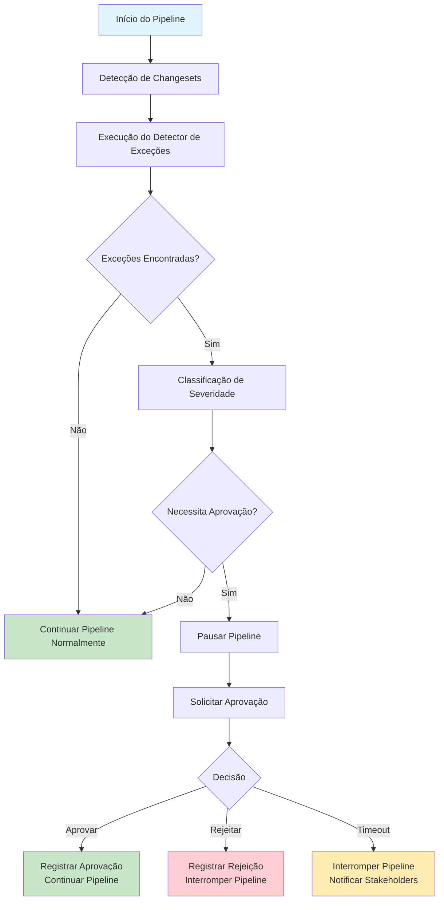

# Fluxo de Continuação ou Interrupção do Pipeline com Base nas Aprovações

## 1. Visão Geral

Este documento detalha o fluxo completo de controle do pipeline Jenkins com base nas decisões de aprovação para exceções `linter-ignore-rule`. O fluxo abrange desde a detecção inicial até a continuação ou interrupção do processo de CI/CD.

## 2. Fluxo Geral do Pipeline

### 2.1 Diagrama de Fluxo Completo


### 2.2 Estados do Pipeline
1. **Início**: Pipeline iniciado normalmente
2. **Detecção**: Análise de changesets em busca de exceções
3. **Classificação**: Avaliação da severidade das exceções encontradas
4. **Decisão**: Determinação se aprovação é necessária
5. **Pausa**: Interrupção controlada do pipeline
6. **Aprovação Pendente**: Aguardando decisão manual
7. **Aprovado**: Decisão positiva registrada
8. **Rejeitado**: Decisão negativa registrada
9. **Timeout**: Tempo limite excedido
10. **Continuação**: Pipeline prossegue normalmente
11. **Interrupção**: Pipeline terminado com falha

## 3. Detalhamento dos Estados e Transições

### 3.1 Estado de Detecção
Neste estado, o sistema verifica todos os changesets em busca de exceções `linter-ignore-rule`.

#### 3.1.1 Processo de Detecção
```python
# /exceptions/services/detection_orchestrator.py
class DetectionOrchestrator:
    def __init__(self, detector, classifier, repository):
        self.detector = detector
        self.classifier = classifier
        self.repository = repository
    
    def detect_and_classify_exceptions(self, changeset_files, environment):
        """
        Detecta e classifica exceções nos changesets fornecidos
        
        Args:
            changeset_files: Lista de arquivos de changeset
            environment: Ambiente de implantação
            
        Returns:
            Lista de exceções classificadas
        """
        all_exceptions = []
        
        for file_path in changeset_files:
            # Detectar exceções no arquivo
            raw_exceptions = self.detector.detect_in_file(file_path)
            
            # Classificar cada exceção detectada
            for exception in raw_exceptions:
                classified_exception = self.classifier.classify_exception(
                    exception, environment
                )
                all_exceptions.append(classified_exception)
                
                # Persistir exceção classificada
                self.repository.save(classified_exception)
        
        return all_exceptions
```

#### 3.1.2 Resultado da Detecção
```json
{
  "detectionResult": {
    "scanId": "uuid-12345",
    "timestamp": "2026-02-02T15:30:00Z",
    "totalFilesScanned": 5,
    "totalExceptionsFound": 3,
    "exceptions": [
      {
        "id": "exc-001",
        "type": "linter-ignore-rule",
        "rule": "no-drop-table",
        "severity": "high",
        "status": "pending_approval"
      },
      {
        "id": "exc-002",
        "type": "linter-ignore-rule",
        "rule": "has-description",
        "severity": "low",
        "status": "auto_approved"
      },
      {
        "id": "exc-003",
        "type": "linter-ignore-rule",
        "rule": "forbid-sale-schema",
        "severity": "critical",
        "status": "pending_approval"
      }
    ]
  }
}
```

### 3.2 Estado de Classificação
As exceções detectadas são classificadas com base em critérios de severidade e contexto.

#### 3.2.1 Processo de Classificação
```python
# /exceptions/services/exception_classifier.py
class ExceptionClassifier:
    def __init__(self, config):
        self.config = config
        self.severity_calculator = SeverityCalculator(config)
        self.environment_adjuster = EnvironmentAdjuster(config)
    
    def classify_exception(self, raw_exception, environment):
        """
        Classifica uma exceção bruta em uma exceção completa
        
        Args:
            raw_exception: Exceção detectada
            environment: Ambiente de implantação
            
        Returns:
            Exceção classificada completa
        """
        # Calcular severidade base
        base_severity = self.severity_calculator.calculate_base_severity(
            raw_exception.rule_name
        )
        
        # Ajustar severidade com base no ambiente
        adjusted_severity = self.environment_adjuster.adjust_severity(
            base_severity, environment
        )
        
        # Determinar se aprovação é necessária
        requires_approval = self._determine_approval_need(
            adjusted_severity, raw_exception
        )
        
        # Definir status inicial
        initial_status = "pending_approval" if requires_approval else "auto_approved"
        
        # Criar exceção classificada
        classified_exception = ClassifiedException(
            id=self._generate_id(),
            raw_exception=raw_exception,
            calculated_severity=adjusted_severity,
            requires_approval=requires_approval,
            status=initial_status,
            detected_at=datetime.utcnow(),
            environment=environment
        )
        
        return classified_exception
    
    def _determine_approval_need(self, severity, exception):
        """Determina se a exceção requer aprovação manual"""
        # Sempre requer aprovação para severidade alta ou crítica
        if severity in ['high', 'critical']:
            return True
        
        # Para severidade média, verificar configuração
        if severity == 'medium':
            return self.config.get('require_approval_for_medium', True)
        
        # Para baixa severidade, verificar se é linter-ignore-all
        if severity == 'low':
            return exception.rule_name == 'linter-ignore-all'
        
        return False
```

### 3.3 Estado de Decisão
Baseado na classificação, determina-se se o pipeline deve ser pausado para aprovação.

#### 3.3.1 Avaliação de Necessidade de Aprovação
```python
# /ci-scripts/jenkins/approval_evaluator.py
class ApprovalEvaluator:
    def __init__(self, config):
        self.config = config
    
    def evaluate_pipeline_action(self, exceptions):
        """
        Avalia qual ação tomar com o pipeline baseado nas exceções
        
        Args:
            exceptions: Lista de exceções classificadas
            
        Returns:
            Dicionário com decisão e detalhes
        """
        if not exceptions:
            return {
                'action': 'continue',
                'reason': 'Nenhuma exceção encontrada',
                'approval_required': False
            }
        
        # Verificar se há exceções que requerem aprovação
        exceptions_needing_approval = [
            exc for exc in exceptions if exc.requires_approval
        ]
        
        if not exceptions_needing_approval:
            return {
                'action': 'continue',
                'reason': 'Todas as exceções podem ser auto-aprovadas',
                'approval_required': False
            }
        
        # Determinar grupo de aprovadores necessário
        required_approvers = self._determine_required_approvers(
            exceptions_needing_approval
        )
        
        # Determinar timeout
        timeout_hours = self._determine_timeout(exceptions_needing_approval)
        
        return {
            'action': 'pause',
            'reason': f'{len(exceptions_needing_approval)} exceções requerem aprovação',
            'approval_required': True,
            'required_approvers': required_approvers,
            'timeout_hours': timeout_hours,
            'exceptions_summary': self._summarize_exceptions(exceptions_needing_approval)
        }
    
    def _determine_required_approvers(self, exceptions):
        """Determina quais grupos precisam aprovar"""
        approvers = set()
        
        for exception in exceptions:
            severity = exception.calculated_severity
            if severity in ['critical', 'high']:
                approvers.add('AD-GROUP')
            elif severity == 'medium':
                approvers.add('TEAM-LEADS')
                approvers.add('SENIOR-DEVS')
        
        return list(approvers)
    
    def _determine_timeout(self, exceptions):
        """Determina timeout baseado na severidade máxima"""
        severities = [exc.calculated_severity for exc in exceptions]
        max_severity = self._get_max_severity(severities)
        
        timeout_config = self.config.get('approval_timeouts', {})
        return timeout_config.get(max_severity, 24)  # Default 24 horas
    
    def _get_max_severity(self, severities):
        """Obtém a severidade máxima"""
        severity_order = ['low', 'medium', 'high', 'critical']
        return max(severities, key=lambda s: severity_order.index(s))
    
    def _summarize_exceptions(self, exceptions):
        """Cria um resumo das exceções"""
        summary = {}
        for exc in exceptions:
            severity = exc.calculated_severity
            summary[severity] = summary.get(severity, 0) + 1
        return summary
```

### 3.4 Estado de Pausa
Quando aprovação é necessária, o pipeline é pausado de forma controlada.

#### 3.4.1 Implementação da Pausa no Jenkins
```groovy
// /ci-scripts/jenkins/stages/approval_stage.groovy
def handleApprovalStage(approvalData) {
    def requiredApprovers = approvalData.required_approvers.join(',')
    def timeoutHours = approvalData.timeout_hours.toInteger()
    
    stage('Aprovação de Exceções Críticas') {
        when {
            expression { approvalData.approval_required }
        }
        steps {
            script {
                // Registrar início da espera por aprovação
                echo "Aguardando aprovação de: ${requiredApprovers}"
                echo "Timeout: ${timeoutHours} horas"
                
                // Enviar notificações
                sendApprovalNotifications(approvalData)
                
                // Pausar pipeline com timeout
                timeout(time: timeoutHours, unit: 'HOURS') {
                    def approvalInput = input(
                        message: createApprovalMessage(approvalData),
                        submitter: requiredApprovers,
                        parameters: [
                            choice(
                                choices: ['Aprovar', 'Rejeitar'],
                                description: 'Decisão sobre as exceções encontradas',
                                name: 'DECISION'
                            ),
                            text(
                                defaultValue: '',
                                description: 'Justificativa detalhada para a decisão',
                                name: 'JUSTIFICATION'
                            )
                        ]
                    )
                    
                    // Processar decisão
                    processApprovalDecision(approvalInput, approvalData)
                }
            }
        }
        post {
            aborted {
                script {
                    // Lidar com timeout
                    handleTimeout(approvalData)
                }
            }
        }
    }
}

def createApprovalMessage(approvalData) {
    def message = "🚨 Exceções críticas encontradas que requerem aprovação:\n\n"
    
    approvalData.exceptions_summary.each { severity, count ->
        message += "• ${count} exceção(ões) de severidade ${severity}\n"
    }
    
    message += "\nDetalhes completos disponíveis no relatório de exceções."
    return message
}

def sendApprovalNotifications(approvalData) {
    // Enviar notificações por email, Slack, etc.
    emailext(
        subject: "Aprovação Necessária - Build ${BUILD_NUMBER}",
        body: createDetailedApprovalEmail(approvalData),
        to: getApproverEmails(approvalData.required_approvers),
        mimeType: 'text/html'
    )
    
    slackSend(
        channel: '#ad-approvals',
        message: "🚨 Build ${BUILD_NUMBER} aguardando aprovação de: ${approvalData.required_approvers.join(', ')}"
    )
}

def processApprovalDecision(approvalInput, approvalData) {
    def decision = approvalInput.DECISION
    def justification = approvalInput.JUSTIFICATION
    
    echo "Decisão registrada: ${decision}"
    echo "Justificativa: ${justification}"
    
    // Registrar decisão no sistema de governança
    sh """
        liquibase-governance record-approval \
            --decision ${decision.toLowerCase()} \
            --justification "${justification}" \
            --approver ${BUILD_USER} \
            --build-number ${BUILD_NUMBER}
    """
    
    if (decision == 'Rejeitar') {
        error("Build rejeitado: ${justification}")
    }
}

def handleTimeout(approvalData) {
    echo "Timeout de ${approvalData.timeout_hours} horas atingido"
    
    // Registrar timeout
    sh """
        liquibase-governance record-timeout \
            --reason "Timeout de aprovação atingido" \
            --build-number ${BUILD_NUMBER}
    """
    
    // Notificar stakeholders
    sendTimeoutNotifications(approvalData)
    
    error("Timeout de aprovação atingido. Pipeline interrompido.")
}
```

### 3.5 Estado de Continuação
Quando exceções são aprovadas ou não requerem aprovação, o pipeline continua normalmente.

#### 3.5.1 Fluxo de Continuação
```groovy
// /ci-scripts/jenkins/stages/continuation_stages.groovy
def handlePipelineContinuation() {
    stage('Continuação do Pipeline') {
        steps {
            script {
                echo "✅ Pipeline continuando após avaliação de exceções"
                
                // Registrar continuação
                sh 'liquibase-governance record-continuation --build-number ${BUILD_NUMBER}'
                
                // Continuar com os estágios normais do pipeline
                parallel(
                    'Validações Técnicas': {
                        runTechnicalValidations()
                    },
                    'Testes Automatizados': {
                        runAutomatedTests()
                    },
                    'Security Checks': {
                        runSecurityChecks()
                    }
                )
            }
        }
    }
}

def runTechnicalValidations() {
    stage('Validações Técnicas') {
        steps {
            sh 'mvn validate'  // Ou outro comando de validação
        }
    }
}

def runAutomatedTests() {
    stage('Testes Automatizados') {
        steps {
            sh 'mvn test'  // Ou outro comando de teste
        }
        post {
            always {
                // Publicar resultados dos testes
                junit '**/target/surefire-reports/*.xml'
            }
        }
    }
}

def runSecurityChecks() {
    stage('Security Checks') {
        steps {
            sh 'sonar-scanner'  // Ou outra ferramenta de segurança
        }
    }
}
```

### 3.6 Estado de Interrupção
Quando exceções são rejeitadas ou ocorre timeout, o pipeline é interrompido.

#### 3.6.1 Processo de Interrupção
```groovy
// /ci-scripts/jenkins/stages/termination_stages.groovy
def handlePipelineTermination(terminationReason) {
    stage('Interrupção do Pipeline') {
        steps {
            script {
                echo "🛑 Pipeline interrompido: ${terminationReason}"
                
                // Registrar interrupção
                sh "liquibase-governance record-termination --reason '${terminationReason}' --build-number ${BUILD_NUMBER}"
                
                // Limpar recursos temporários
                cleanUpResources()
                
                // Notificar stakeholders
                sendTerminationNotifications(terminationReason)
                
                // Marcar build como falho
                error("Pipeline interrompido: ${terminationReason}")
            }
        }
    }
}

def cleanUpResources() {
    sh '''
        # Remover arquivos temporários
        rm -rf temp/ || true
        rm -f *.tmp || true
        
        # Limpar estado do sistema de governança
        liquibase-governance cleanup-build-state --build-number ${BUILD_NUMBER}
    '''
}

def sendTerminationNotifications(reason) {
    def message = """
        🛑 Build ${BUILD_NUMBER} foi interrompido
        
        Motivo: ${reason}
        
        Detalhes disponíveis em: ${BUILD_URL}
    """
    
    slackSend(
        channel: '#dev-notifications',
        message: message
    )
    
    emailext(
        subject: "Build ${BUILD_NUMBER} Interrompido",
        body: message,
        to: 'dev-team@company.com',
        mimeType: 'text/plain'
    )
}
```

## 4. Controle de Estado e Persistência

### 4.1 Modelo de Estado do Pipeline
```python
# /ci-scripts/jenkins/models/pipeline_state.py
from enum import Enum
from dataclasses import dataclass
from typing import List, Optional
from datetime import datetime

class PipelineState(Enum):
    STARTED = "started"
    DETECTION_RUNNING = "detection_running"
    DETECTION_COMPLETED = "detection_completed"
    CLASSIFICATION_RUNNING = "classification_running"
    CLASSIFICATION_COMPLETED = "classification_completed"
    APPROVAL_EVALUATION = "approval_evaluation"
    PAUSED_FOR_APPROVAL = "paused_for_approval"
    APPROVAL_GRANTED = "approval_granted"
    APPROVAL_REJECTED = "approval_rejected"
    TIMEOUT_OCCURRED = "timeout_occurred"
    CONTINUING = "continuing"
    TERMINATED = "terminated"

@dataclass
class PipelineExecutionState:
    build_number: int
    job_name: str
    current_state: PipelineState
    exceptions_detected: List[dict]
    approval_required: bool
    required_approvers: List[str]
    timeout_hours: Optional[int]
    approval_decision: Optional[str]
    approval_justification: Optional[str]
    approval_timestamp: Optional[datetime]
    termination_reason: Optional[str]
    started_at: datetime
    updated_at: datetime
    
    def update_state(self, new_state: PipelineState, **kwargs):
        """Atualiza o estado do pipeline"""
        self.current_state = new_state
        self.updated_at = datetime.utcnow()
        
        # Atualizar campos específicos conforme o novo estado
        for key, value in kwargs.items():
            if hasattr(self, key):
                setattr(self, key, value)
```

### 4.2 Serviço de Gestão de Estado
```python
# /ci-scripts/jenkins/services/state_manager.py
import json
from datetime import datetime
from .models.pipeline_state import PipelineState, PipelineExecutionState

class PipelineStateManager:
    def __init__(self, storage_backend):
        self.storage = storage_backend
    
    def initialize_state(self, build_number, job_name):
        """Inicializa o estado do pipeline"""
        state = PipelineExecutionState(
            build_number=build_number,
            job_name=job_name,
            current_state=PipelineState.STARTED,
            exceptions_detected=[],
            approval_required=False,
            required_approvers=[],
            timeout_hours=None,
            approval_decision=None,
            approval_justification=None,
            approval_timestamp=None,
            termination_reason=None,
            started_at=datetime.utcnow(),
            updated_at=datetime.utcnow()
        )
        
        self._save_state(state)
        return state
    
    def update_state(self, build_number, new_state, **kwargs):
        """Atualiza o estado do pipeline"""
        state = self._load_state(build_number)
        state.update_state(new_state, **kwargs)
        self._save_state(state)
        return state
    
    def get_current_state(self, build_number):
        """Obtém o estado atual do pipeline"""
        return self._load_state(build_number)
    
    def _save_state(self, state):
        """Salva o estado no backend de armazenamento"""
        state_data = {
            'build_number': state.build_number,
            'job_name': state.job_name,
            'current_state': state.current_state.value,
            'exceptions_detected': state.exceptions_detected,
            'approval_required': state.approval_required,
            'required_approvers': state.required_approvers,
            'timeout_hours': state.timeout_hours,
            'approval_decision': state.approval_decision,
            'approval_justification': state.approval_justification,
            'approval_timestamp': state.approval_timestamp.isoformat() if state.approval_timestamp else None,
            'termination_reason': state.termination_reason,
            'started_at': state.started_at.isoformat(),
            'updated_at': state.updated_at.isoformat()
        }
        
        self.storage.save_pipeline_state(state.build_number, state_data)
    
    def _load_state(self, build_number):
        """Carrega o estado do backend de armazenamento"""
        state_data = self.storage.load_pipeline_state(build_number)
        if not state_data:
            raise Exception(f"Estado não encontrado para build {build_number}")
        
        # Converter dados em objeto PipelineExecutionState
        state = PipelineExecutionState(
            build_number=state_data['build_number'],
            job_name=state_data['job_name'],
            current_state=PipelineState(state_data['current_state']),
            exceptions_detected=state_data['exceptions_detected'],
            approval_required=state_data['approval_required'],
            required_approvers=state_data['required_approvers'],
            timeout_hours=state_data['timeout_hours'],
            approval_decision=state_data['approval_decision'],
            approval_justification=state_data['approval_justification'],
            approval_timestamp=datetime.fromisoformat(state_data['approval_timestamp']) if state_data['approval_timestamp'] else None,
            termination_reason=state_data['termination_reason'],
            started_at=datetime.fromisoformat(state_data['started_at']),
            updated_at=datetime.fromisoformat(state_data['updated_at'])
        )
        
        return state
```

## 5. Monitoramento e Observabilidade

### 5.1 Métricas de Fluxo do Pipeline
```python
# /monitoring/pipeline_flow_metrics.py
from prometheus_client import Counter, Histogram, Gauge

class PipelineFlowMetrics:
    def __init__(self):
        self.pipeline_executions = Counter(
            'pipeline_executions_total',
            'Total de execuções de pipeline',
            ['job_name', 'result']
        )
        
        self.exception_detections = Counter(
            'exception_detections_total',
            'Total de exceções detectadas',
            ['severity', 'rule_type']
        )
        
        self.approval_decisions = Counter(
            'approval_decisions_total',
            'Total de decisões de aprovação',
            ['decision', 'approver_group']
        )
        
        self.pipeline_duration = Histogram(
            'pipeline_duration_seconds',
            'Duração total do pipeline em segundos',
            ['job_name', 'had_exceptions']
        )
        
        self.approval_wait_time = Histogram(
            'approval_wait_time_seconds',
            'Tempo de espera por aprovação em segundos',
            ['severity']
        )
        
        self.current_pipelines_paused = Gauge(
            'current_pipelines_paused',
            'Número de pipelines atualmente pausados para aprovação',
            ['severity']
        )
    
    def record_pipeline_execution(self, job_name, result):
        self.pipeline_executions.labels(
            job_name=job_name,
            result=result
        ).inc()
    
    def record_exception_detection(self, severity, rule_type):
        self.exception_detections.labels(
            severity=severity,
            rule_type=rule_type
        ).inc()
    
    def record_approval_decision(self, decision, approver_group):
        self.approval_decisions.labels(
            decision=decision,
            approver_group=approver_group
        ).inc()
    
    def record_pipeline_duration(self, duration_seconds, job_name, had_exceptions):
        self.pipeline_duration.labels(
            job_name=job_name,
            had_exceptions=str(had_exceptions).lower()
        ).observe(duration_seconds)
    
    def record_approval_wait_time(self, wait_time_seconds, severity):
        self.approval_wait_time.labels(
            severity=severity
        ).observe(wait_time_seconds)
    
    def increment_pipelines_paused(self, severity):
        self.current_pipelines_paused.labels(
            severity=severity
        ).inc()
    
    def decrement_pipelines_paused(self, severity):
        self.current_pipelines_paused.labels(
            severity=severity
        ).dec()
```

### 5.2 Dashboards de Monitoramento

#### 5.2.1 Dashboard de Saúde do Pipeline
```
DASHBOARD: Saúde do Pipeline de Governança

┌─────────────────────────────────────────────────────────────┐
│ PIPELINES ATIVOS                    │ PIPELINES HOJE        │
│ ┌─────────────────────────────────┐ │ ┌─────────────────┐   │
│ │ Total: 24                       │ │ │ Iniciados: 48   │   │
│ │ Pausados: 3                     │ │ │ Concluídos: 42  │   │
│ │ Com Erros: 1                    │ │ │ Com Erros: 3    │   │
│ └─────────────────────────────────┘ │ │ Timeout: 3      │   │
│                                     │ └─────────────────┘   │
├─────────────────────────────────────────────────────────────┤
│ EXCEÇÕES DETECTADAS HOJE                                   │
│ ┌─────────────────────────────────────────────────────────┐ │
│ │ Críticas: 2  │ Altas: 5  │ Médias: 12  │ Baixas: 23     │ │
│ └─────────────────────────────────────────────────────────┘ │
├─────────────────────────────────────────────────────────────┤
│ TAXA DE APROVAÇÃO                                          │
│ ┌─────────────────────────────────────────────────────────┐ │
│ │ Aprovadas: 85%  │ Rejeitadas: 10%  │ Timeout: 5%       │ │
│ └─────────────────────────────────────────────────────────┘ │
├─────────────────────────────────────────────────────────────┤
│ TEMPO MÉDIO DE APROVAÇÃO                                   │
│ ┌─────────────────────────────────────────────────────────┐ │
│ │ Críticas: 2.3h  │ Altas: 1.8h  │ Médias: 0.9h          │ │
│ └─────────────────────────────────────────────────────────┘ │
└─────────────────────────────────────────────────────────────┘
```

## 6. Tratamento de Cenários Especiais

### 6.1 Pipeline Paralelo com Múltiplas Branches
```groovy
// Tratamento para builds paralelas
def handleParallelPipelines() {
    def branches = [:]
    
    // Para cada branch relevante
    ['develop', 'staging', 'main'].each { branch ->
        branches[branch] = {
            node {
                stage("Process ${branch}") {
                    // Configurar ambiente específico
                    env.BRANCH_NAME = branch
                    env.ENVIRONMENT = getEnvironmentForBranch(branch)
                    
                    // Executar fluxo de governança específico
                    executeGovernanceFlow()
                }
            }
        }
    }
    
    // Executar em paralelo
    parallel branches
}

def getEnvironmentForBranch(branch) {
    switch(branch) {
        case 'develop': return 'development'
        case 'staging': return 'staging'
        case 'main': return 'production'
        default: return 'development'
    }
}
```

### 6.2 Retrabalho e Reexecução
```groovy
// /ci-scripts/jenkins/stages/rework_stages.groovy
def handleReworkScenario() {
    stage('Rework de Changesets') {
        steps {
            script {
                // Verificar se é uma reexecução
                if (params.IS_REWORK) {
                    echo "🔄 Executando rework de changesets"
                    
                    // Aplicar configurações específicas para rework
                    sh 'liquibase-governance apply-rework-config --rework-id ${params.REWORK_ID}'
                    
                    // Pular algumas validações para acelerar o processo
                    env.SKIP_NON_CRITICAL_VALIDATIONS = 'true'
                }
                
                // Continuar com o fluxo normal
                executeGovernanceFlow()
            }
        }
    }
}
```

## 7. Integração com Ferramentas Externas

### 7.1 Integração com JIRA
```python
# /ci-scripts/jenkins/integrations/jira_integration.py
import requests
from typing import Dict, List

class JiraIntegration:
    def __init__(self, config):
        self.base_url = config['jira_url']
        self.auth_token = config['auth_token']
        self.project_key = config['project_key']
    
    def create_exception_ticket(self, exception_data: Dict) -> str:
        """Cria um ticket JIRA para uma exceção crítica"""
        issue_data = {
            'fields': {
                'project': {
                    'key': self.project_key
                },
                'summary': f'Exceção Crítica: {exception_data["rule"]} em {exception_data["changeset_id"]}',
                'description': self._create_description(exception_data),
                'issuetype': {
                    'name': 'Task'
                },
                'priority': {
                    'name': self._map_severity_to_priority(exception_data['severity'])
                },
                'labels': ['governance-exception', f'severity-{exception_data["severity"]}'],
                'customfield_10001': exception_data['changeset_author'],  # Custom field para autor
                'customfield_10002': exception_data['file_path']         # Custom field para arquivo
            }
        }
        
        response = requests.post(
            f'{self.base_url}/rest/api/2/issue',
            json=issue_data,
            headers={
                'Authorization': f'Bearer {self.auth_token}',
                'Content-Type': 'application/json'
            }
        )
        
        if response.status_code == 201:
            issue_key = response.json()['key']
            return issue_key
        else:
            raise Exception(f'Falha ao criar ticket JIRA: {response.text}')
    
    def _create_description(self, exception_data: Dict) -> str:
        """Cria descrição detalhada para o ticket"""
        return f"""
        **Exceção de Governança Detectada**
        
        **Detalhes:**
        - Regra Ignorada: {exception_data['rule']}
        - Severidade: {exception_data['severity']}
        - Changeset: {exception_data['changeset_author']}:{exception_data['changeset_id']}
        - Arquivo: {exception_data['file_path']}
        - Linha: {exception_data['line_number']}
        
        **Justificativa do Desenvolvedor:**
        {exception_data.get('justification', 'Nenhuma justificativa fornecida')}
        
        **Links Úteis:**
        - Build: {exception_data.get('build_url', 'N/A')}
        - Relatório Completo: {exception_data.get('report_url', 'N/A')}
        
        **Ações Necessárias:**
        1. Revisar a justificativa
        2. Avaliar o impacto
        3. Tomar decisão de aprovação
        """
    
    def _map_severity_to_priority(self, severity: str) -> str:
        """Mapeia severidade para prioridade JIRA"""
        mapping = {
            'critical': 'Highest',
            'high': 'High',
            'medium': 'Medium',
            'low': 'Low'
        }
        return mapping.get(severity, 'Medium')
```

### 7.2 Integração com Slack
```groovy
// /ci-scripts/jenkins/integrations/slack_integration.groovy
def sendEnhancedSlackNotification(notificationData) {
    def messageBlocks = [
        [
            "type": "header",
            "text": [
                "type": "plain_text",
                "text": notificationData.title
            ]
        ],
        [
            "type": "section",
            "text": [
                "type": "mrkdwn",
                "text": notificationData.message
            ]
        ]
    ]
    
    // Adicionar seção de exceções se houver
    if (notificationData.exceptions) {
        def exceptionFields = notificationData.exceptions.collect { exc ->
            [
                "type": "mrkdwn",
                "text": "*${exc.rule}*\\nSeverity: ${exc.severity}\\nAuthor: ${exc.author}"
            ]
        }
        
        messageBlocks << [
            "type": "section",
            "text": [
                "type": "mrkdwn",
                "text": "*Exceções Encontradas:*"
            ],
            "fields": exceptionFields.take(10)  // Limitar a 10 campos
        ]
    }
    
    // Adicionar botões de ação
    messageBlocks << [
        "type": "actions",
        "elements": [
            [
                "type": "button",
                "text": [
                    "type": "plain_text",
                    "text": "Ver Detalhes"
                ],
                "url": notificationData.detailsUrl,
                "style": "primary"
            ],
            [
                "type": "button",
                "text": [
                    "type": "plain_text",
                    "text": "Aprovar"
                ],
                "url": notificationData.approvalUrl,
                "style": "danger"
            ]
        ]
    ]
    
    slackSend(
        channel: notificationData.channel,
        blocks: groovy.json.JsonBuilder(messageBlocks).toString(),
        attachments: []
    )
}
```

## 8. Configuração e Personalização

### 8.1 Configuração do Fluxo por Ambiente
```yaml
# /config/pipeline_flow_config.yaml
pipeline_flow:
  environments:
    development:
      auto_approve_low_severity: true
      auto_approve_medium_severity: true
      require_approval_high_severity: true
      require_approval_critical_severity: true
      timeout_hours:
        low: 1
        medium: 2
        high: 6
        critical: 12
      approvers:
        - "DEVELOPERS"
        - "TEAM-LEADS"
      
    staging:
      auto_approve_low_severity: false
      auto_approve_medium_severity: false
      require_approval_high_severity: true
      require_approval_critical_severity: true
      timeout_hours:
        low: 2
        medium: 4
        high: 12
        critical: 24
      approvers:
        - "TEAM-LEADS"
        - "QA-LEADS"
      
    production:
      auto_approve_low_severity: false
      auto_approve_medium_severity: false
      require_approval_high_severity: true
      require_approval_critical_severity: true
      timeout_hours:
        low: 4
        medium: 8
        high: 24
        critical: 48
      approvers:
        - "AD-GROUP"
        - "RELEASE-MANAGERS"
  
  thresholds:
    max_exceptions_per_build: 50
    max_critical_exceptions_per_build: 5
    warn_on_exceptions_count: 10
  
  notifications:
    slack_channels:
      critical_exceptions: "#ad-alerts"
      approval_needed: "#ad-approvals"
      general_updates: "#dev-notifications"
    
    email_recipients:
      critical_exceptions: ["ad-team@company.com", "release-managers@company.com"]
      pipeline_failures: ["dev-team@company.com"]
  
  retry_policy:
    detection_attempts: 3
    approval_check_interval_minutes: 5
    max_approval_check_attempts: 12  # 1 hora
```

## 9. Documentação do Fluxo para Usuários

### 9.1 Guia Rápido para Desenvolvedores
```
FLUXO DE GOVERNANÇA PARA DESENVOLVEDORES

1. SUBMISSÃO DE CHANGESETS
   → Faça commit dos seus changesets normalmente
   → O pipeline de CI/CD iniciará automaticamente

2. DETECÇÃO AUTOMÁTICA
   → O sistema verifica por linter-ignore-rule
   → Exceções são classificadas por severidade
   → Você receberá feedback no pipeline

3. POSSÍVEIS RESULTADOS
   ✅ SEM EXCEÇÕES: Pipeline continua automaticamente
   ⚠️  BAIXA/MÉDIA SEVERIDADE: Pode continuar automaticamente (dependendo do ambiente)
   🚨 ALTA/CRÍTICA SEVERIDADE: Pipeline pausado para aprovação

4. QUANDO APROVAÇÃO É NECESSÁRIA
   → Receba notificação via Slack/email
   → Acesse o painel de aprovações
   → Veja detalhes da exceção e contexto do código
   → Forneça justificativa clara para a exceção

5. APÓS APROVAÇÃO
   → Pipeline continua automaticamente
   → Você será notificado do resultado
   → Changeset é processado normalmente
```

### 9.2 Guia para Aprovadores (AD-GROUP)
```
GUIA PARA APROVADORES

1. RECEBER NOTIFICAÇÕES
   → Alertas automáticos via Slack/email
   → Acesso ao painel de aprovações em tempo real
   → Detalhes completos das exceções pendentes

2. ANALISAR EXCEÇÕES
   → Ver contexto completo do código
   → Avaliar justificativa do desenvolvedor
   → Considerar impacto no ambiente de destino
   → Consultar histórico do autor se necessário

3. TOMAR DECISÃO
   [APROVAR] 
   → Confirme que entende a justificativa
   → Adicione sua própria justificativa se necessário
   → Pipeline continua automaticamente
   
   [REJEITAR]
   → Explique claramente o motivo da rejeição
   → Sugira alternativas quando possível
   → Pipeline é interrompido

4. MONITORAMENTO
   → Acompanhe métricas de aprovação
   → Identifique padrões problemáticos
   → Participe de retrospectivas de governança
```

Este fluxo detalhado de continuação ou interrupção do pipeline fornece um framework completo para gestão de exceções `linter-ignore-rule` no contexto de CI/CD com Jenkins, garantindo controle adequado sem comprometer a eficiência do processo de desenvolvimento.