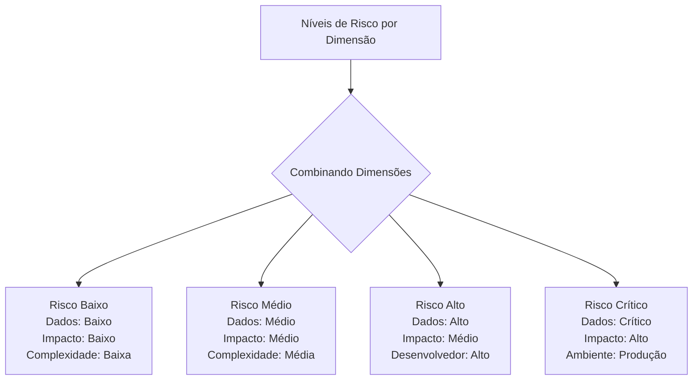
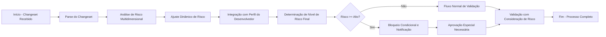

# Critérios de Avaliação de Risco em Changesets para Sistema de Governança Automatizada do Liquibase

## 1. Visão Geral

Este documento especifica os critérios abrangentes de avaliação de risco para changesets no sistema de governança automatizada do Liquibase. Os critérios são baseados em múltiplas dimensões de análise que consideram aspectos técnicos, contextuais e comportamentais para fornecer uma avaliação holística do risco associado a cada mudança proposta.

## 2. Dimensões Principais de Avaliação de Risco

### 2.1 Criticidade de Dados (Data Criticality)
Avalia o nível de sensibilidade e importância dos dados afetados pela mudança.

### 2.2 Impacto em Cascata (Cascade Impact)
Analisa as consequências potenciais da mudança em outros componentes do sistema.

### 2.3 Contexto de Tabelas (Table Context)
Considera o tipo e o propósito das tabelas envolvidas na mudança.

### 2.4 Perfil do Desenvolvedor (Developer Profile)
Avalia o histórico e o comportamento do desenvolvedor responsável pela mudança.

### 2.5 Complexidade Técnica (Technical Complexity)
Mede a sofisticação e dificuldade técnica da mudança proposta.

### 2.6 Ambiente de Implantação (Deployment Environment)
Considera o ambiente onde a mudança será aplicada.

## 3. Critérios Quantitativos e Qualitativos por Dimensão

### 3.1 Criticidade de Dados

#### 3.1.1 Critérios Quantitativos
| Métrica | Baixo | Médio | Alto | Crítico |
|---------|-------|-------|------|---------|
| Número de registros afetados | < 100 | 100-1000 | 1000-10000 | > 10000 |
| Número de campos sensíveis | 0 | 1-2 | 3-5 | > 5 |
| Frequência de acesso aos dados | < 10 acessos/dia | 10-100 acessos/dia | 100-1000 acessos/dia | > 1000 acessos/dia |

#### 3.1.2 Critérios Qualitativos
- **Tipo de Dado**:
  - Baixo: Dados não sensíveis, dados de teste
  - Médio: Dados de identificação básica, dados comerciais não críticos
  - Alto: Dados financeiros, informações de clientes não sensíveis
  - Crítico: Dados pessoais sensíveis (PII), dados de saúde, credenciais

- **Localização de Dados**:
  - Baixo: Ambientes de desenvolvimento/teste
  - Médio: Ambientes de staging/homologação
  - Alto: Ambientes de pré-produção
  - Crítico: Ambientes de produção

### 3.2 Impacto em Cascata

#### 3.2.1 Critérios Quantitativos
| Métrica | Baixo | Médio | Alto | Crítico |
|---------|-------|-------|------|---------|
| Número de dependências diretas | 0-2 | 3-5 | 6-10 | > 10 |
| Número de dependências indiretas | 0-5 | 6-15 | 16-30 | > 30 |
| Número de queries afetadas | 0-1 | 2-5 | 6-10 | > 10 |
| Tempo estimado de execução (min) | < 1 | 1-5 | 5-30 | > 30 |

#### 3.2.2 Critérios Qualitativos
- **Tipo de Impacto**:
  - Baixo: Alterações cosméticas, comentários
  - Médio: Mudanças estruturais em objetos não críticos
  - Alto: Alterações em objetos críticos com dependências
  - Crítico: Quebra de funcionalidades críticas, perda de dados

- **Risco de Downtime**:
  - Baixo: Nenhum risco de indisponibilidade
  - Médio: Janela de manutenção curta (< 5 min)
  - Alto: Janela de manutenção moderada (5-30 min)
  - Crítico: Longo período de indisponibilidade (> 30 min)

### 3.3 Contexto de Tabelas

#### 3.3.1 Critérios Quantitativos
| Métrica | Baixo | Médio | Alto | Crítico |
|---------|-------|-------|------|---------|
| Tamanho estimado da tabela (MB) | < 100 | 100-1000 | 1000-10000 | > 10000 |
| Número de índices afetados | 0-1 | 2-3 | 4-5 | > 5 |
| Número de constraints afetadas | 0 | 1 | 2-3 | > 3 |

#### 3.4 Perfil do Desenvolvedor

#### 3.4.1 Critérios Quantitativos
| Métrica | Baixo | Médio | Alto | Crítico |
|---------|-------|-------|------|---------|
| Taxa de aprovação de mudanças (%) | > 90 | 70-90 | 50-70 | < 50 |
| Número de exceções críticas nos últimos 30 dias | 0 | 1 | 2-3 | > 3 |
| Tempo médio de resolução de problemas (horas) | < 2 | 2-8 | 8-24 | > 24 |

#### 3.4.2 Critérios Qualitativos
- **Experiência do Desenvolvedor**:
  - Baixo: Desenvolvedor novo ou com pouca experiência
  - Médio: Desenvolvedor experiente com bom histórico
  - Alto: Desenvolvedor sênior com histórico consistente
  - Crítico: Desenvolvedor com histórico problemático

- **Comportamento de Risco**:
  - Baixo: Segue boas práticas consistentemente
  - Médio: Ocasional desvio de práticas recomendadas
  - Alto: Frequente solicitação de exceções
  - Crítico: Padrões consistentes de comportamento de alto risco

### 3.5 Complexidade Técnica

#### 3.5.1 Critérios Quantitativos
| Métrica | Baixo | Médio | Alto | Crítico |
|---------|-------|-------|------|---------|
| Número de operações no changeset | 1 | 2-3 | 4-5 | > 5 |
| Número de linhas de código DDL/DML | < 10 | 10-50 | 50-100 | > 100 |
| Número de schemas envolvidos | 1 | 2 | 3 | > 3 |

#### 3.5.2 Critérios Qualitativos
- **Tipo de Operação**:
  - Baixo: Criação de índices, comentários
  - Médio: Alterações de estrutura simples, inserções de dados
  - Alto: Modificações complexas de schema, atualizações em massa
  - Crítico: Remoções de dados/objetos, modificações de constraints críticas

### 3.6 Ambiente de Implantação

#### 3.6.1 Critérios Qualitativos
- **Tipo de Ambiente**:
  - Baixo: Desenvolvimento, testes unitários
  - Médio: Testes de integração, staging
  - Alto: Pré-produção, homologação
  - Crítico: Produção, ambientes críticos de negócio

## 4. Matriz de Classificação de Risco Combinada

A classificação de risco final é determinada pela combinação ponderada das dimensões avaliadas. Cada dimensão recebe um peso com base em sua importância para a organização:

| Dimensão | Peso Relativo |
|----------|---------------|
| Criticidade de Dados | 25% |
| Impacto em Cascata | 20% |
| Contexto de Tabelas | 15% |
| Perfil do Desenvolvedor | 15% |
| Complexidade Técnica | 15% |
| Ambiente de Implantação | 10% |

### 4.1 Matriz de Decisão de Risco

| Nível de Risco | Threshold de Pontuação | Critério de Decisão |
|----------------|------------------------|---------------------|
| Baixo | 0.0 - 2.5 | Aprovação automática para a maioria dos ambientes |
| Médio | 2.6 - 5.0 | Revisão durante Code Review, aprovação simplificada |
| Alto | 5.1 - 7.5 | Aprovação obrigatória, notificação de stakeholders relevantes |
| Crítico | 7.6 - 10.0 | Aprovação de Arquiteto/Administrador de Dados, bloqueio automático em produção |

### 4.2 Exemplos de Combinação de Fatores



## 5. Mecanismos de Ajuste Dinâmico de Risco

### 5.1 Fatores Contextuais que Influenciam o Risco

#### 5.1.1 Horário de Submissão
- Fora do horário comercial normal: +0.5 pontos no risco base
- Horário crítico de negócios: +1.0 ponto no risco base
- Janela de manutenamento programada: -0.5 pontos no risco base

#### 5.1.2 Sazonalidade
- Período próximo ao fechamento fiscal: +1.0 ponto no risco base
- Época de picos de acesso: +0.75 pontos no risco base
- Período de baixa atividade: -0.25 pontos no risco base

#### 5.1.3 Estado do Sistema
- Sistema sob carga elevada: +0.5 pontos no risco base
- Sistema em manutenção: +1.0 ponto no risco base
- Sistema em estado crítico: +2.0 pontos no risco base

### 5.2 Ajustes Temporais

#### 5.2.1 Ajuste por Urgência
- Mudança urgente com justificativa: -1.0 ponto no risco calculado
- Mudança de última hora sem justificativa adequada: +2.0 pontos no risco base

#### 5.2.2 Ajuste por Frequência
- Primeira ocorrência de um padrão: +0.5 pontos no risco base
- Frequência elevada de padrões similares: -0.25 pontos no risco base (padronização)

## 6. Integração com Modelo de Classificação de Exceções

### 6.1 Mapeamento entre Risco e Severidade de Exceções

| Nível de Risco | Severidade de Exceção Equivalente | Tratamento |
|----------------|-----------------------------------|------------|
| Baixo | Baixa | Registro para auditoria, aprovação automática |
| Médio | Média | Revisão durante Code Review, possível aprovação simplificada |
| Alto | Alta | Aprovação obrigatória, notificação de stakeholders |
| Crítico | Crítica | Bloqueio automático, aprovação de AD obrigatória |

### 6.2 Estrutura de Dados Estendida

```python
@dataclass
class RiskAssessment:
    risk_level: str  # "low", "medium", "high", "critical"
    overall_score: float  # Pontuação de 0.0 a 10.0
    dimension_scores: Dict[str, float]  # Scores individuais por dimensão
    contributing_factors: List[str]  # Fatores que contribuíram para o risco
    mitigation_recommendations: List[str]  # Recomendações para reduzir o risco
    adjusted_for_context: bool  # Se o risco foi ajustado por fatores contextuais
    dynamic_adjustments: List[str]  # Ajustes dinâmicos aplicados
    
@dataclass
class EnhancedExceptionRecord(ExceptionRecord):
    risk_assessment: RiskAssessment
    cascade_impact_prediction: Optional[CascadeImpactPrediction]
    critical_data_elements: List[CriticalDataElement]
    table_context: Optional[TableContext]
    developer_profile: Optional[DeveloperProfile]
    contextual_severity: str  # Severidade ajustada com base em contexto
```

### 6.3 Integração com o Pipeline de Validação



## 7. Critérios para Tomada de Decisão Automatizada

### 7.1 Aprovação Automática
Uma mudança pode ser aprovada automaticamente quando:
- Nível de risco calculado é "Baixo"
- Nenhuma regra de governança é violada
- O ambiente é de desenvolvimento/teste
- O desenvolvedor tem perfil de baixo risco

### 7.2 Revisão Humana Necessária
Revisão manual é necessária quando:
- Nível de risco é "Médio" ou superior
- Exceções críticas são detectadas
- Mudanças afetam componentes críticos
- Ambiente de produção está envolvido

### 7.3 Bloqueio Automático
Mudanças são bloqueadas automaticamente quando:
- Nível de risco é "Crítico"
- Violações de segurança grave são detectadas
- Ambiente de produção e perfil de desenvolvedor é de alto risco
- Ausência de justificativa adequada para risco elevado

## 8. Métricas de Monitoramento e Melhoria Contínua

### 8.1 Métricas de Avaliação de Risco
- Precisão das predições de risco vs. incidentes reais
- Tempo médio para ajuste de modelos de risco
- Correlação entre risco previsto e aprovações/rejeições
- Número de falsos positivos/negativos nas avaliações

### 8.2 Métricas de Impacto no Negócio
- Redução em mudanças problemáticas após implementação
- Tempo economizado em revisões manuais
- Aumento na confiança nas implantações
- Melhoria na qualidade geral das mudanças

### 8.3 Métricas de Performance do Sistema
- Latência da avaliação de risco por changeset
- Utilização de recursos durante análise
- Escalabilidade com volume crescente de mudanças
- Tempo de atualização de perfis de desenvolvedores

## 9. Considerações de Implementação

### 9.1 Coleta de Dados
- Integrar com sistemas de monitoramento existentes
- Coletar métricas de performance em tempo real
- Manter histórico de mudanças e seus resultados
- Utilizar catálogos de metadados do banco de dados

### 9.2 Atualização de Modelos
- Implementar pipelines de atualização de modelos preditivos
- Utilizar aprendizado contínuo com feedback humano
- Manter versões de modelos para rollback quando necessário
- Validar modelos antes de deploy em ambientes sensíveis

### 9.3 Integração com Pipeline CI/CD
- Executar análise de risco durante o processo de validação
- Fornecer relatórios detalhados para revisão humana
- Integrar com sistemas de aprovação existentes
- Bloquear automaticamente mudanças de alto risco em produção