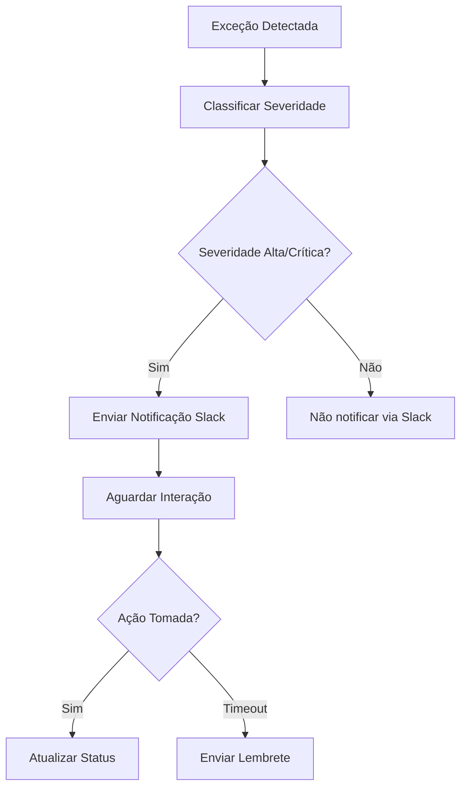
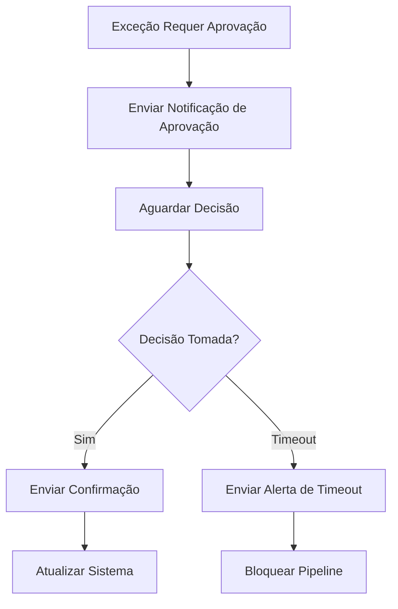

# Design de Notificações via Slack para Sistema de Governança do Liquibase

## 1. Tipos de Notificações

### 1.1 Notificação de Exceção Crítica Detectada
- **Quando**: Quando uma exceção de severidade alta ou crítica é detectada
- **Destinatários**: Grupo AD-GROUP, desenvolvedor responsável
- **Canal**: #ad-alerts
- **Objetivo**: Alertar imediatamente sobre exceções que requerem atenção urgente

### 1.2 Notificação de Aprovação Pendente
- **Quando**: Quando uma exceção requer aprovação manual
- **Destinatários**: Grupo AD-GROUP
- **Canal**: #ad-approvals
- **Objetivo**: Solicitar decisão sobre aprovação/rejeição de exceções

### 1.3 Notificação de Aprovação Realizada
- **Quando**: Quando uma exceção pendente é aprovada/rejeitada
- **Destinatários**: Desenvolvedor, AD-GROUP
- **Canal**: #ad-approvals
- **Objetivo**: Informar sobre a decisão tomada

### 1.4 Notificação de Timeout de Aprovação
- **Quando**: Quando o tempo limite para aprovação de exceção expira
- **Destinatários**: AD-GROUP, equipe de engenharia
- **Canal**: #ad-alerts
- **Objetivo**: Alertar sobre atrasos na aprovação de exceções críticas

### 1.5 Notificação de Build Impactado
- **Quando**: Quando um build é afetado por exceções não resolvidas
- **Destinatários**: Equipe de desenvolvimento
- **Canal**: #dev-notifications
- **Objetivo**: Informar sobre impacto no processo de CI/CD

## 2. Estrutura das Mensagens

### 2.1 Elementos Comuns
- Ícone contextual (❗ ⚠️ ✅ ⏰ 🔧)
- Título claro e conciso
- Identificação do build/envolvido
- Severidade da situação
- Links para detalhes e ações
- Timestamp

### 2.2 Estrutura Hierárquica de Informações
1. **Cabeçalho**: Tipo e severidade do evento
2. **Resumo**: Informações essenciais (quem, o que, quando)
3. **Contexto**: Detalhes relevantes do changeset
4. **Ações**: Botões para intervenção direta
5. **Rodapé**: Informações adicionais/contexto

## 3. Conteúdo Contextual por Tipo de Notificação

### 3.1 Exceção Crítica Detectada
```
Informações Essenciais:
- ID do changeset (autor:id)
- Regra ignorada
- Severidade calculada
- Arquivo e linha

Informações de Contexto:
- Justificativa fornecida pelo desenvolvedor
- Ambiente (dev/homolog/prod)
- Timestamp de detecção
- Link para o build no CI/CD

Ações Disponíveis:
- Aprovar/Rejeitar exceção
- Visualizar detalhes completos
- Acessar o changeset original
```

### 3.2 Aprovação Pendente
```
Informações Essenciais:
- Número total de exceções pendentes
- Prazo para aprovação
- Build associado

Informações de Contexto:
- Lista das exceções prioritárias
- Responsáveis pela aprovação
- Histórico recente de aprovações

Ações Disponíveis:
- Acessar painel de aprovações
- Marcar como revisado
- Solicitar extensão de prazo
```

### 3.3 Aprovação Realizada
```
Informações Essenciais:
- Quem aprovou/rejeitou
- Quantas exceções foram processadas
- Resultado da aprovação

Informações de Contexto:
- Detalhes das exceções tratadas
- Timestamp da decisão
- Comentários adicionais

Ações Disponíveis:
- Visualizar histórico completo
- Contatar o avaliador
- Reverter decisão (se aplicável)
```

## 4. Integração com Componentes do Sistema

### 4.1 Módulo de Exceções
- Consumir eventos do Exception Engine
- Integrar-se com Exception Reporter
- Utilizar Exception Repository para dados contextuais

### 4.2 Módulo de CI/CD
- Receber gatilhos de eventos do pipeline
- Acessar informações do build
- Interagir com mecanismos de pausa/bloqueio

### 4.3 Módulo de Auditoria
- Registrar envio de notificações
- Armazenar respostas/interações
- Manter histórico para compliance

## 5. Fluxos de Trabalho

### 5.1 Fluxo de Exceção Crítica


### 5.2 Fluxo de Aprovação


## 6. Personalização e Configuração

### 6.1 Configuração por Ambiente
- Ambiente DEV: Notificações menos intrusivas
- Ambiente HOMOLOG: Notificações padrão
- Ambiente PROD: Notificações de máxima prioridade

### 6.2 Configuração por Severidade
- Baixa: Somente logging
- Média: Notificação discreta
- Alta: Notificação prioritária
- Crítica: Notificação com múltiplos canais

## 7. Boas Práticas para Notificações

### 7.1 Clareza e Concisão
- Linguagem objetiva e direta
- Evitar jargões técnicos excessivos
- Foco na ação necessária

### 7.2 Timing Adequado
- Enviar notificações no momento certo
- Evitar spam durante horários não comerciais
- Considerar fusos horários dos destinatários

### 7.3 Ações Significativas
- Botões com rótulos claros
- Links funcionais e relevantes
- Feedback imediato após interações