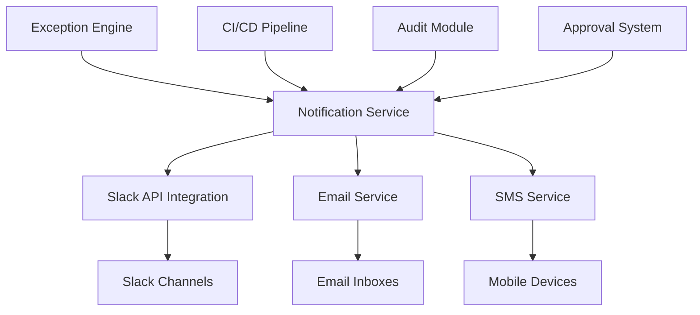

# Sistema Completo de Notificações do Slack para Governança do Liquibase

## 1. Visão Geral

Este documento descreve o sistema completo de notificações via Slack para o sistema de governança de changesets do Liquibase. O sistema visa prover comunicação eficaz, contextual e acionável sobre eventos relacionados à governança de banco de dados.

### 1.1 Objetivos
- Alertar rapidamente sobre exceções críticas
- Facilitar o processo de aprovação de exceções
- Manter stakeholders informados sobre o estado dos builds
- Garantir rastreabilidade completa das decisões
- Minimizar tempo de resposta a situações críticas

### 1.2 Público-Alvo
- Administradores de Dados (AD-GROUP)
- Desenvolvedores
- Equipes de DevOps/DBA
- Stakeholders de negócio

## 2. Arquitetura do Sistema de Notificações

### 2.1 Componentes Principais


### 2.2 Fluxo de Dados
1. Eventos são gerados pelos módulos do sistema (exceções, aprovações, etc.)
2. Notification Service coleta e processa eventos
3. Mensagens são formatadas conforme o canal de destino
4. Notificações são enviadas via APIs apropriadas
5. Respostas/interações são registradas para auditoria

## 3. Tipos de Notificações

### 3.1 Exceção Crítica Detectada
**Evento**: Uma exceção de severidade alta ou crítica é identificada
**Prioridade**: Máxima
**Canal**: #ad-alerts
**Ação Requerida**: Imediata revisão e decisão

### 3.2 Aprovação Pendente
**Evento**: Exceções aguardam aprovação manual
**Prioridade**: Alta
**Canal**: #ad-approvals
**Ação Requerida**: Revisão e aprovação/rejeição

### 3.3 Aprovação Realizada
**Evento**: Decisão tomada sobre exceções pendentes
**Prioridade**: Média
**Canal**: #ad-approvals
**Ação Requerida**: Informacional

### 3.4 Timeout de Aprovação
**Evento**: Tempo limite para aprovação esgotado
**Prioridade**: Máxima
**Canal**: #ad-alerts
**Ação Requerida**: Intervenção imediata

### 3.5 Build Impactado
**Evento**: Build afetado por exceções não resolvidas
**Prioridade**: Média
**Canal**: #dev-notifications
**Ação Requerida**: Monitoramento

## 4. Estrutura de Mensagens

### 4.1 Elementos Comuns
1. **Cabeçalho** - Tipo e severidade do evento
2. **Sumário** - Informações essenciais de alto nível
3. **Divisor** - Separação visual de seções
4. **Detalhes** - Informações contextuais específicas
5. **Ações** - Botões para intervenção direta
6. **Contexto** - Informações adicionais (timestamps, etc.)

### 4.2 Hierarquia de Informações
```
⚠️ Nível 1: Imagem de impacto visual imediato
🚨 Nível 2: Título claro e descritivo
📝 Nível 3: Sumário quantitativo
📋 Nível 4: Detalhes específicos por item
⚙️ Nível 5: Ações acionáveis
🕒 Nível 6: Metadados contextuais
```

## 5. Formatação e Estilo

### 5.1 Diretrizes Visuais
- **Consistência**: Mesmo padrão de estrutura para todos os tipos
- **Clareza**: Informação mais importante visível sem rolagem
- **Acionabilidade**: Botões com texto descritivo claro
- **Hierarquia**: Uso de negrito, itálico e espaçamento adequado

### 5.2 Paleta de Cores/Estilos
- **Perigo/Alerta**: Style="danger" (botões vermelhos)
- **Ação Principal**: Style="primary" (botões azuis)
- **Secundário**: Style="default" (botões cinzas)
- **Sucesso**: Ícones verdes e checkboxes

### 5.3 Uso de Emojis
- **Alertas**: 🚨 ⚠️ ❗ 
- **Sucesso**: ✅ ✔️ 
- **Processos**: 📋 🔧 ⚙️ 
- **Tempo**: ⏰ ⌛ 🕒 
- **Informação**: ℹ️ 🔍 📝 

## 6. Integração Técnica

### 6.1 API do Slack
- **Método Principal**: Webhooks de entrada
- **Autenticação**: Webhook URLs específicos por canal
- **Limites**: 1 req/segundo por webhook
- **Formatação**: Blocos rico com Markdown

### 6.2 Estrutura de Payloads
- **Fallback text** para clientes básicos
- **Blocks array** para formatação rica
- **Metadata contextual** para rastreabilidade
- **Actions buttons** para interações diretas

### 6.3 Tratamento de Erros
- **Retry com backoff exponencial**
- **Log detalhado de falhas**
- **Fallback para canais alternativos**
- **Alerta sobre falhas persistentes**

## 7. Configuração e Personalização

### 7.1 Por Ambiente
- **DEV**: Notificações silenciosas ou desabilitadas
- **HOMOLOG**: Notificações padrão para testes
- **PROD**: Notificações de máxima prioridade

### 7.2 Por Severidade
- **Baixa**: Somente logging interno
- **Média**: Notificações discretas
- **Alta**: Notificações priorizadas
- **Crítica**: Multi-canal com alertas imediatos

### 7.3 Por Canal
- **#ad-alerts**: Somente eventos críticos e de alta prioridade
- **#ad-approvals**: Fluxo completo de aprovações
- **#dev-notifications**: Impactos e informações gerais

## 8. Governança e Compliance

### 8.1 Auditoria
- Registro completo de todas as notificações enviadas
- Tracking de interações com botões e links
- Correlação com decisões de aprovação tomadas
- Retenção de logs por período definido

### 8.2 Privacy
- Proteção de dados sensíveis em mensagens
- Conformidade com regulamentações aplicáveis
- Controle de acesso a canais e informações

### 8.3 Métricas
- Taxa de entrega de notificações
- Tempo médio de resposta às notificações
- Frequência de uso dos diferentes canais
- Efetividade dos diferentes tipos de notificação

## 9. Testabilidade e Manutenção

### 9.1 Ambientes de Teste
- Canais dedicados para validação de mensagens (#liquibase-test)
- Mocks da API do Slack para testes unitários
- Ambiente de staging para testes E2E

### 9.2 Monitoramento
- Dashboards de saúde do sistema de notificações
- Alertas sobre taxa elevada de falhas
- Métricas de performance e latência

### 9.3 Versionamento
- Templates versionados junto com o código
- Migrações de formato quando necessário
- Documentação atualizada das mudanças

## 10. Futuras Melhorias

### 10.1 Funcionalidades Planejadas
- Integração com bots interativos do Slack
- Menus dropdown para seleção de ações
- Modais para visualização detalhada
- Notificações programadas/resumos periódicos

### 10.2 Expansão do Escopo
- Métricas agregadas de governança
- Alertas preditivos baseados em padrões
- Sugestões inteligentes de aprovação
- Feedback loop com desenvolvedores

---

*Este sistema representa uma abordagem abrangente e escalável para manter todos os stakeholders informados sobre eventos importantes no processo de governança do Liquibase, garantindo resposta rápida e tomada de decisão eficaz.*