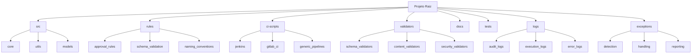

# Estrutura de Diretórios do Projeto

## Visão Geral

Esta estrutura foi projetada para suportar a governança automatizada de changesets do Liquibase com foco em aprovação condicional baseada em regras e integração com CI/CD.

## Diretórios Principais

### `/src`
Código fonte principal em Python:

- `core/` - Lógica central do sistema
- `utils/` - Funções utilitárias
- `models/` - Modelos de dados

### `/rules`
Definições de regras para aprovação condicional:

- `approval_rules/` - Regras para aprovação automática
- `schema_validation/` - Regras de validação de esquema
- `naming_conventions/` - Convenções de nomenclatura

### `/ci-scripts`
Scripts de integração com sistemas de CI/CD:

- `jenkins/` - Scripts específicos para Jenkins
- `gitlab_ci/` - Scripts para GitLab CI
- `generic_pipelines/` - Scripts genéricos para outros pipelines

### `/validators`
Componentes de validação de changesets:

- `schema_validators/` - Validadores de esquema
- `content_validators/` - Validadores de conteúdo
- `security_validators/` - Validadores de segurança

### `/docs`
Documentação técnica:

- `architecture/` - Documentos de arquitetura
- `processes/` - Processos e fluxos de trabalho
- `api/` - Documentação da API
- `guides/` - Guias de uso

### `/tests`
Testes automatizados:

- `unit/` - Testes unitários
- `integration/` - Testes de integração
- `e2e/` - Testes end-to-end

### `/logs`
Registros de auditoria e logs:

- `audit_logs/` - Logs de auditoria de ações
- `execution_logs/` - Logs de execução
- `error_logs/` - Logs de erros

### `/exceptions`
Tratamento de exceções e casos especiais:

- `detection/` - Componentes de detecção de exceções
- `handling/` - Componentes de tratamento de exceções
- `reporting/` - Relatórios de exceções

## Arquivos de Configuração

Arquivos de configuração raiz que afetam todo o projeto:

- `requirements.txt` - Dependências do Python
- `config.yaml` - Configurações gerais
- `.gitignore` - Arquivos ignorados pelo Git
- `README.md` - Documentação principal